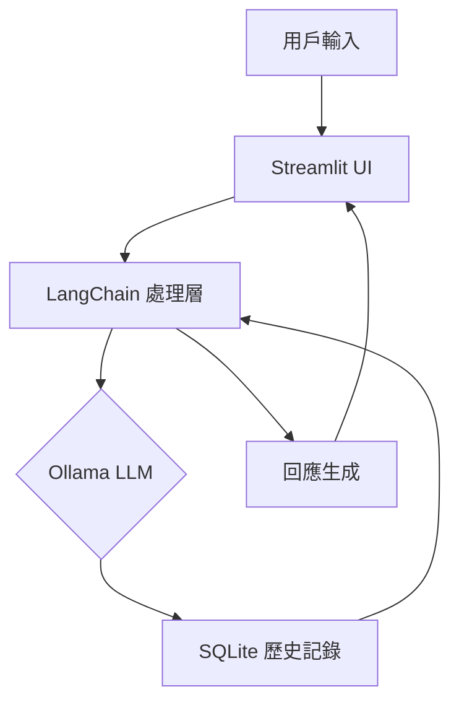

# LLM 聊天機器人開發完整技術筆記

## 1. 核心技術架構圖



## 2. 完整模組解析

### 2.1 語言模型初始化

```python
llm = ChatOllama(
    base_url="http://localhost:11434",  # Ollama 服務端點
    model="qwen2.5:latest",            # 模型版本選擇
    temperature=0.5,                   # 創造性控制 (0-1)
    max_tokens=250,                    # 回應長度限制
    top_p=0.9,                         # 核採樣參數
    frequency_penalty=0.2              # 重複懲罰
)
```

**參數說明表：**

| 參數 | 範圍 | 最佳實踐 | 影響效果 |
| :--- | :--- | :--- | :--- |
| temperature | 0-1 | 創意場景:0.7-0.9 | 數值越高回答越隨機 |
| max_tokens | 50-4000 | 對話場景:200-300 | 控制回應長度 |
| top_p | 0-1 | 通常0.8-0.95 | 影響回答多樣性 |

### 2.2 對話歷史管理系統

```python
def get_session_history(session_id: str) -> SQLChatMessageHistory:
    """SQLite 實現的對話記憶體管理"""
    return SQLChatMessageHistory(
        session_id=session_id,
        connection_string="sqlite:///chathistory.db",
        table_name="chat_history",      # 自定義表名
        session_id_field="user_id"      # 自定義字段名
    )
```

**數據表結構：**

```sql
CREATE TABLE chat_history (
    id INTEGER PRIMARY KEY AUTOINCREMENT,
    user_id TEXT NOT NULL,
    message TEXT NOT NULL,
    role TEXT NOT NULL,  -- 'user' or 'assistant'
    timestamp DATETIME DEFAULT CURRENT_TIMESTAMP
);
```

### 2.3 流式響應處理引擎

```python
def invoke_history(chain, session_id, prompt):
    """實現字元級流式輸出"""
    history = RunnableWithMessageHistory(
        chain,
        get_session_history,
        input_messages_key="prompt",
        history_messages_key="history",
        history_factory_config=[
            ConfigurableFieldSpec(
                id="session_id",
                annotation=str,
                description="Unique session identifier",
                default="",
            )
        ]
    )
    
    # 添加自定義中斷檢查
    for chunk in history.stream(
        {"prompt": prompt},
        config={"configurable": {"session_id": session_id}}
    ):
        if should_interrupt():  # 自定義中斷檢查
            break
        yield chunk
```

## 3. 進階功能實作

### 3.1 多專家模式系統提示

```python
expert_profiles = {
    "Beginner": "使用簡單詞彙和短句子回答，避免專業術語",
    "Expert": "提供技術細節和行業標準解決方案",
    "PhD": "包含學術引用、數學公式和最新研究成果"
}

template = ChatPromptTemplate.from_messages([
    MessagesPlaceholder(variable_name="history"),
    ('system', f"""
     你現在是{role}級別的專業顧問，需遵守以下規則：
     1. {expert_profiles[role]}
     2. 當不確定答案時要求澄清
     3. 嚴格遵守{max_tokens}字元長度限制
    """),
    ('human', "{prompt}")
])
```

### 3.2 上下文壓縮策略

```python
from langchain.memory import ConversationSummaryBufferMemory

# 在記憶體超過1000 tokens時自動摘要
memory = ConversationSummaryBufferMemory(
    llm=llm,
    max_token_limit=1000,
    memory_key="history",
    return_messages=True
)

# 在對話鏈中整合
chain = (
    {"prompt": RunnablePassthrough(), "history": memory.load_memory_variables} 
    | template 
    | llm
)
```

## 4. 效能優化技巧

### 4.1 快取機制實現

```python
from langchain.cache import SQLiteCache
import langchain

# 配置SQLite快取
langchain.llm_cache = SQLiteCache(
    database_path=".llm_cache.db",
    ttl=3600  # 1小時過期
)

# 在Ollama初始化時添加
llm = ChatOllama(
    ...,
    cache=True,
    metadata={"project": "chatbot_v2"}
)
```

### 4.2 非同步處理模式

```python
async def async_invoke_history(chain, session_id, prompt):
    history = RunnableWithMessageHistory(
        ...,
        async_get_session_history=get_session_history
    )
    
    async for chunk in history.astream(
        {"prompt": prompt},
        config={"configurable": {"session_id": session_id}}
    ):
        yield chunk

# 在Streamlit中使用
async def update_chat():
    async with st.spinner("思考中..."):
        async for chunk in async_invoke_history(chain, user_id, prompt):
            response.write(chunk)
```

## 5. 生產環境部署建議

### 5.1 Docker 部署配置

```dockerfile
FROM python:3.9-slim

WORKDIR /app
COPY . .

RUN pip install --no-cache-dir -r requirements.txt

# 預下載模型
RUN ollama pull qwen2.5:latest

EXPOSE 8501
CMD ["streamlit", "run", "ChatbotWithCosmetic.py", "--server.port=8501"]
```

### 5.2 監控指標設置

```python
from prometheus_client import start_http_server, Counter, Histogram

# 定義指標
REQUEST_COUNT = Counter('chat_requests', 'Total chat requests')
RESPONSE_TIME = Histogram('response_time', 'Response latency in seconds')

# 在處理函數中添加
@RESPONSE_TIME.time()
def handle_request(prompt):
    REQUEST_COUNT.inc()
    return generate_response(prompt)

# 啟動指標服務器
start_http_server(8000)
```

## 6. 故障排除指南

### 常見錯誤與解決方案

| 錯誤類型 | 可能原因 | 解決方案 |
| :--- | :--- | :--- |
| 連接拒絕 | Ollama 服務未啟動 | `ollama serve &` |
| 模型未找到 | 未下載指定模型 | `ollama pull qwen2.5:latest` |
| 記憶體不足 | 對話歷史過長 | 啟用摘要功能或限制歷史長度 |
| 回應截斷 | `max_tokens` 設置過小 | 增加到300-500 |
| SQLite鎖定 | 多進程寫入 | 改用PostgreSQL或添加重試機制 |

## 7. 擴展功能藍圖

### 知識檢索增強

```python
from langchain.retrievers import BM25Retriever
retriever = BM25Retriever.from_texts(docs)
```

### 多模態處理

```python
from langchain_community.llms import OllamaMultimodal
mm_llm = OllamaMultimodal(model="llava:latest")
```

### 審查過濾器

```python
from langchain.output_parsers import CommaSeparatedListOutputParser
safety_filter = CommaSeparatedListOutputParser()
```

### 情感分析集成

```python
from transformers import pipeline
sentiment_analyzer = pipeline("sentiment-analysis")
```

## 附錄：

* Ollama 模型庫
* LangChain 官方文檔
* Streamlit 組件指南
