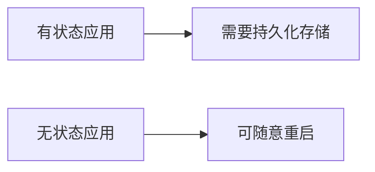

h1. GKE预读材料中文摘要

h2. 1. 容器基础概念
* *核心定义*: 
** 标准化软件单元，包含代码与所有依赖项
** 共享主机操作系统内核，比虚拟机更轻量

* *核心优势*:
# 跨环境可移植性
# 资源利用率高（节省30-50%资源）
# 快速弹性伸缩（秒级启动）
# 进程级隔离（通过cgroups/namespaces）

h2. 2. 工作负载部署
* *关键要素*:
1. 容器镜像构建（Dockerfile最佳实践）
2. 容器运行时选择（containerd/CRI-O）
3. 网络连通性配置（CNI插件）

* *部署方式对比*:
| *方式* | *复杂度* | *适用场景* |
| 手动部署 | 低 | 开发测试环境 |
| 编排工具 | 高 | 生产环境（推荐K8s） |

h2. 3. 应用状态管理
* *状态类型*:

- 典型案例:
    - 有状态：数据库、购物车系统
    - 无状态：Web服务器、CDN节点

h2. 4. 自动扩缩容
扩缩模式:
- 垂直扩缩（调整单节点资源）
- 水平扩缩（增减实例数量）

- 核心价值:
    - 成本优化（节省20-40%云支出）
    - 弹性保障（应对流量峰值）
    - 自动化运维（减少人工干预）
h2. 5. GCP基础架构
- 关键组件:
    - 项目(Project)：资源隔离边界
    - VPC网络：软件定义网络
    - IAM：基于角色的访问控制
    - 共享VPC：跨项目网络共享
h2. 6. Kubernetes架构
核心组件:
```
控制平面:
- API Server
- Scheduler
- Controller Manager

工作节点:
- Kubelet
- Container Runtime
- kube-proxy
关键抽象:
Pod：最小调度单元（1-N个容器）
Service：服务发现与负载均衡
Volume：数据持久化方案
```
h2. 7. 网络与安全
- 服务暴露方式:
    - ClusterIP（集群内访问）
    - NodePort（节点端口映射）
    - LoadBalancer（云厂商LB集成）
- 网络策略:
    - Ingress：入站流量管理（支持L7路由）
    - Egress：出站流量控制
    - NetworkPolicy：微服务间通信管控

h2. 8. SRE基础
```
服务等级体系:
| 指标 | 定义 | 示例 |
| SLI | 服务质量量化指标 | 请求成功率 |
| SLO | SLI目标阈值 | 99.9%可用性 |
| SLA | 具有法律效力的SLO承诺 | 未达标赔偿10%费用 |
```
h2. 9. 学习建议
先掌握Docker基础操作
理解Pod/Service核心概念
动手实践GKE控制台操作
关注网络与存储设计方案

