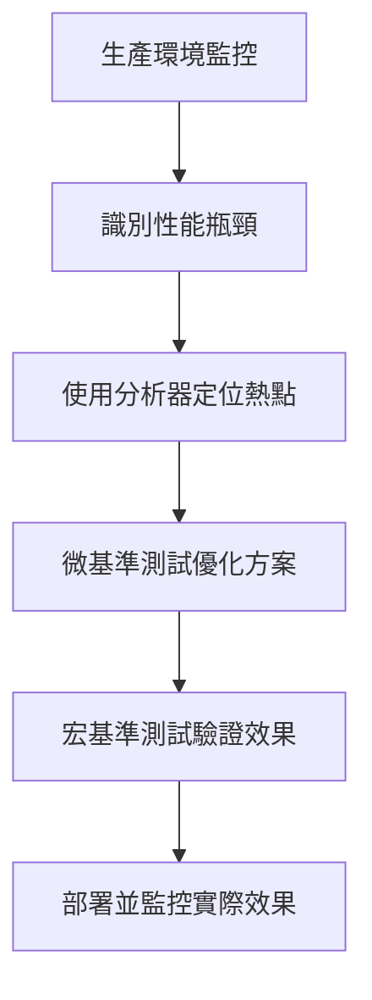

# Java 記憶體管理與軟性記憶體洩漏（Soft Leaks）筆記

## 🎯 核心概念

### 軟性記憶體洩漏（Soft Leaks）
- **定義**：物件雖然不再使用，但由於仍被引用而無法被垃圾回收
- **與傳統記憶體洩漏的區別**：
  - 傳統洩漏：程式結束後記憶體仍無法釋放
  - 軟性洩漏：程式結束時記憶體會釋放，但運行期間記憶體持續增長

### 問題影響
```java
// 錯誤範例：物件從未被正確移除
public Customer getNextCustomer() {
    return customers.get(lastProcessedIndex++); // 只是讀取，未移除！
}
```
- **長期運行的應用**（如 Web Server）會逐漸耗盡堆記憶體
- **最終導致**：`OutOfMemoryError: Java heap space`

## 🔧 診斷工具：JVisualVM

### 安裝與啟動
- **Oracle JDK**：內建於 `bin` 目錄
- **OpenJDK**：需從 [visualvm.github.io](https://visualvm.github.io) 下載

### 使用步驟
1. 啟動 JVisualVM
2. 選擇要監控的 Java 應用程式
3. 開啟「Monitor」標籤頁
4. 觀察「Heap」圖表

### 健康應用程式特徵
```java
// 健康應用程式的記憶體使用模式
- 記憶體使用量穩定波動
- 定期垃圾回收釋放記憶體
- 不會持續增長
```

### 問題應用程式特徵
```java
// 有記憶體洩漏的應用程式
- 記憶體使用量持續上升
- 垃圾回收效果不明顯
- 最終達到堆記憶體上限
```

## 🛠️ 實務診斷技巧

### 壓力測試設定
```bash
# 設定較小的堆記憶體，加速問題顯現
java -Xmx50m MyApplication
```

### 監控指標
- **Used Heap**：已使用的堆記憶體
- **Total Heap**：當前堆總大小
- **Garbage Collection**：垃圾回收發生時的記憶體釋放

## 💡 問題解決範例

### 問題程式碼
```java
// 錯誤：未實際移除物件
public Customer getNextCustomer() {
    if (lastProcessedIndex > customers.size()) {
        return null;
    }
    return customers.get(lastProcessedIndex++); // 只是移動索引！
}
```

### 修正方案
```java
// 正確：實際移除物件
public Customer getNextCustomer() {
    synchronized(customers) {
        if (customers.size() > 0) {
            return customers.remove(0); // 實際移除！
        }
        return null;
    }
}
```

## 📊 記憶體管理最佳實踐

### 開發階段
1. **設定適當的堆大小**進行測試
2. **定期監控記憶體使用**模式
3. **模擬長期運行**情境

### 生產環境
1. **監控應用程式記憶體**使用趨勢
2. **設定適當的堆記憶體**大小
3. **建立警報機制**監控異常記憶體增長

### 程式設計原則
1. **及時釋放不再使用的引用**
2. **注意集合物件的生命週期管理**
3. **在多執行緒環境中妥善管理共享資源**

## ⚠️ 重要提醒
軟性記憶體洩漏雖然不會導致系統級的記憶體洩漏，但會嚴重影響應用程式的穩定性和效能，特別是在長期運行的伺服器應用中。透過適當的工具和測試方法，可以及早發現並解決這類問題。


# Java 記憶體分析與堆轉儲（Heap Dump）筆記

## 🎯 核心概念

### 堆轉儲（Heap Dump）
- **定義**：Java 堆記憶體在特定時間點的快照檔案
- **用途**：分析記憶體使用情況，診斷記憶體洩漏問題

## 🔧 生成堆轉儲的三種方法

### 方法一：JVisualVM 圖形界面
```bash
# 啟動 JVisualVM
jvisualvm
```
**步驟**：
1. 選擇目標 Java 應用程式
2. 點擊「Heap Dump」按鈕
3. 自動生成並顯示檔案位置

### 方法二：JVM 啟動參數（生產環境推薦）
```bash
# 當發生 OutOfMemoryError 時自動生成堆轉儲
java -XX:+HeapDumpOnOutOfMemoryError -XX:HeapDumpPath=/path/to/dump.hprof MyApplication
```

### 方法三：Eclipse MAT 直接獲取
1. 開啟 Eclipse Memory Analyzer
2. File → Acquire Heap Dump
3. 選擇正在運行的 Java 進程

## 🛠️ 記憶體分析工具：Eclipse MAT

### 安裝與啟動
- **下載網址**：`eclipse.org/mat`
- **免安裝**：解壓縮後直接執行 `MemoryAnalyzer`
- **跨平台**：支援 Windows、Linux、macOS

### 分析報告類型

#### 1. 記憶體洩漏嫌疑報告（Leak Suspects Report）
- **用途**：自動識別可能的記憶體洩漏
- **顯示**：
  - 占用記憶體最多的物件
  - 物件引用鏈（Reference Chain）
  - 記憶體分布餅圖

#### 2. 組件報告（Component Report）
- **用途**：分析記憶體使用細節
- **內容**：
  - 重複字串
  - 空集合
  - 其他優化機會

## 📊 實務分析案例

### 問題症狀
- 應用程式記憶體使用量持續增長
- 最終出現 `OutOfMemoryError: Java heap space`
- 垃圾回收無法有效釋放記憶體

### 分析步驟

#### 步驟 1：生成堆轉儲
```java
// 在記憶體使用高峰或崩潰前生成堆轉儲
// 使用 JVisualVM 或設定 JVM 參數
```

#### 步驟 2：使用 MAT 分析
1. 開啟堆轉儲檔案（.hprof）
2. 選擇「Leak Suspects Report」
3. 解讀分析結果

#### 步驟 3：解讀分析結果
**關鍵指標**：
- **Retained Heap**：物件實際占用的記憶體大小
- **Shallow Heap**：物件本身的大小
- **Dominator Tree**：顯示記憶體支配關係

### 實際案例解析
```java
// MAT 分析結果顯示：
// - CustomerManager 物件占用 37.5MB
// - ArrayList 包含大量 Customer 物件
// - 問題：物件只被加入，從未被移除
```

**問題根源**：
```java
// 錯誤程式碼：未正確移除物件
public Customer getNextCustomer() {
    return customers.get(lastProcessedIndex++); // 只是讀取，未移除！
}

// 正確修正：
public Customer getNextCustomer() {
    synchronized(customers) {
        if (customers.size() > 0) {
            return customers.remove(0); // 實際移除物件
        }
        return null;
    }
}
```

## 💡 記憶體分析最佳實踐

### 開發階段
1. **定期生成堆轉儲**進行分析
2. **設定適當的堆大小**進行壓力測試
3. **監控記憶體增長趨勢**

### 生產環境
1. **啟用自動堆轉儲**參數
2. **保留崩潰時的堆轉儲**檔案
3. **建立記憶體監控告警**

### 分析技巧
1. **關注 Retained Heap** 大的物件
2. **檢查集合物件的生命週期**
3. **分析物件引用鏈**找到根源
4. **比較多個時間點**的堆轉儲

## ⚠️ 重要提醒

記憶體分析工具雖然強大，但需要結合業務邏輯來解讀結果。找到記憶體占用大的物件後，需要進一步分析這些物件是否真的需要長期存在，還是應該被及時釋放。
透過堆轉儲分析，可以系統性地找到記憶體洩漏的根源，而不是盲目地調整堆記憶體大小。
# Java 垃圾回收機制深入解析

## 垃圾回收的基本概念

### 效率考量
- 垃圾回收過程需要佔用CPU資源
- 回收效率越高，對應用程序的影響越小
- 現代垃圾回收器使用"標記-清除"算法

### 標記-清除算法 (Mark and Sweep)
**兩階段過程：**

1. **標記階段 (Marking)**
   - 暫停所有線程執行（"Stop The World"事件）
   - 檢查所有存活引用：
     - 棧中的變量
     - 元空間中的靜態變量
   - 標記所有可達對象為存活狀態

2. **清除階段 (Sweeping)**
   - 釋放未標記對象的內存
   - 將存活對象整理到連續的內存塊中
   - 防止堆內存碎片化

## 分代垃圾回收 (Generational GC)

### 基本原則
- **觀察結果**：大多數Java對象存活時間很短
- **推論**：存活過一次GC的對象很可能永遠存活
- **解決方案**：將堆分為不同代區

### 堆內存結構
```
堆 (Heap)
├── 年輕代 (Young Generation)
│   ├── Eden區
│   ├── S0 (Survivor Space 0)
│   └── S1 (Survivor Space 1)
└── 老年代 (Old Generation)
```

### 年輕代回收過程

1. **初始狀態**：新對象分配到Eden區
2. **Eden區滿時**：觸發Minor GC
3. **存活對象移動**：從Eden區移動到S0
4. **下一次GC**：檢查Eden + S0，存活對象移動到S1
5. **交替進行**：S0和S1輪流存放存活對象

### 對象晉升機制
- 每次在Survivor區之間移動，對象"代齡"增加
- 達到一定代齡閾值後，對象晉升到老年代
- 閾值可配置

## 垃圾回收類型

### Minor Collection（年輕代回收）
- **頻率**：非常頻繁
- **速度**：極快（毫秒級）
- **影響**：用戶無感知
- **特點**：年輕代空間小，大部分對象為垃圾

### Major Collection（老年代回收）
- **頻率**：相對較少
- **速度**：較慢（可能幾秒鐘）
- **影響**：用戶可能感知到應用暫停
- **觸發條件**：老年代空間不足

## 性能優勢

### 分代GC的優點
1. **局部性原理**：只掃描部分堆空間
2. **效率提升**：年輕代回收非常快速
3. **內存整理**：Survivor區提供現成的連續空間
4. **代價**：總有一個Survivor區空閒（少量內存浪費）

### 實際表現
- **高效應用**：年輕代頻繁回收，老年代很少回收
- **內存洩漏**：老年代持續增長最終導致OOM

## 監控工具實例

### VisualVM + Visual GC插件
**監控指標：**
- Eden區使用情況
- Survivor區對象移動
- 老年代增長趨勢
- GC事件頻率和持續時間

### 健康應用特徵
- 年輕代頻繁但快速的GC
- 老年代穩定或緩慢增長
- Survivor區對象正常交替

### 問題應用特徵
- 老年代持續快速增長
- Major GC頻繁發生
- 最終老年代完全佔滿，應用停滯

## 關鍵要點總結

1. **GC本質**：不是收集垃圾，而是搶救存活對象
2. **分代設計**：基於對象存活時間的統計規律
3. **性能平衡**：通過空間換取時間效率
4. **監控重要性**：通過可視化工具理解應用內存行為

> 注意：Java 9+ 的垃圾回收機制有所改進，將在後續章節詳細介紹。

# Java 垃圾回收調優與算法選擇

## 監控垃圾回收

### 啟用詳細GC日誌
```bash
-verbose:gc
```

### GC日誌解讀
```
[GC (Allocation Failure)  65536K->5600K(251392K), 0.0023456 secs]
```
- **GC**：年輕代回收（Minor GC）
- **Full GC**：老年代回收（Major GC）
- **原因**：Allocation Failure（分配失敗）、Ergonomics（JVM自我優化）
- **數字含義**：回收前大小->回收後大小(堆總大小)，耗時

## 垃圾回收調優參數

### 1. 堆內存分配比例

#### New Ratio（新老代比例）
```bash
-XX:NewRatio=1
```
- **含義**：老年代與年輕代的大小比例
- **默認值**：2（老年代是年輕代的2倍）
- **調優建議**：降低比值可增加年輕代大小

#### Survivor Ratio（倖存區比例）
```bash
-XX:SurvivorRatio=5
```
- **含義**：年輕代中Eden與Survivor區的比例
- **默認值**：8（Eden佔年輕代的6/8，每個Survivor佔1/8）
- **調優建議**：降低比值可增加Survivor區大小

### 2. 對象晉升閾值

#### Max Tenuring Threshold
```bash
-XX:MaxTenuringThreshold=15
```
- **含義**：對象晉升到老年代前需要經歷的GC次數
- **默認值**：15
- **最大值**：15（某些版本允許16+，表示永不晉升）
- **注意**：實際值可能由JVM動態調整

### 3. 自適應大小策略
```bash
-XX:-UseAdaptiveSizePolicy
```
- **默認**：啟用（+）
- **作用**：JVM根據運行情況動態調整各代大小
- **禁用**：使用減號（-）

## 垃圾收集器類型

### 1. 串行收集器 (Serial Collector)
```bash
-XX:+UseSerialGC
```
- **特點**：單線程執行GC
- **適用場景**：
  - 單處理器環境
  - 後台任務，性能要求不高
  - 需要為其他應用保留CPU資源

### 2. 并行收集器 (Parallel Collector)
```bash
-XX:+UseParallelGC
```
- **特點**：多線程執行年輕代GC
- **別名**：吞吐量收集器
- **Java 8默認**：是
- **適用場景**：多處理器、大數據集

### 3. 並發收集器 (Mostly Concurrent)

#### CMS收集器
```bash
-XX:+UseConcMarkSweepGC
```
- **特點**：盡量減少"Stop The World"時間

#### G1收集器 (Garbage First)
```bash
-XX:+UseG1GC
```
- **Java 9+默認**：是
- **特點**：分區域收集，可預測停頓時間

## G1垃圾收集器詳解

### 工作原理
- **區域化**：堆分為2048個區域
- **動態分配**：區域可動態分配給Eden、Survivor、Old
- **垃圾優先**：優先回收垃圾最多的區域

### 與傳統GC的區別
| 特性 | 傳統GC | G1 GC |
|------|--------|-------|
| 堆結構 | 連續分代 | 分區域 |
| 收集方式 | 整代收集 | 區域收集 |
| 停頓時間 | 不穩定 | 可預測 |

### G1調優參數

#### 並發GC線程數
```bash
-XX:ConcGCThreads=2
```
- **作用**：控制並發收集的線程數

#### 堆使用率觸發閾值
```bash
-XX:InitiatingHeapOccupancyPercent=45
```
- **默認**：45%
- **含義**：當堆使用率達到此值時觸發GC

## 字符串去重優化

### 啟用字符串去重
```bash
-XX:+UseG1GC -XX:+UseStringDeduplication
```

### 工作原理
- **時機**：GC運行時檢測重複字符串
- **方法**：比較哈希值，合併相同字符串
- **效果**：減少內存使用

### 適用場景
- 存在大量重複字符串對象
- 字符串生命周期較長
- 內存受限環境
- 字符串未駐留（intern）在字符串池中

## 調優實踐建議

### 監控工具
1. **VisualVM**：可視化監控堆使用情況
2. **jinfo**：查看JVM參數當前值
3. **GC日誌**：詳細分析GC行為

### 調優步驟
1. **分析應用特徵**：對象生命周期模式
2. **選擇合適收集器**：基於硬件和需求
3. **調整內存比例**：優化各代大小
4. **監控驗證**：觀察調優效果
5. **迭代優化**：持續調整參數

### 注意事項
- G1收集器在大多數情況下無需手動調優
- 避免過度調優，保持簡單
- 測試環境驗證後再應用於生產環境

# Java 監控工具連接運行中進程的方法

## 1. VisualVM 連接運行中 Java 進程

### 自動檢測本地進程
```bash
# 啟動 VisualVM（在 JDK 的 bin 目錄下）
jvisualvm
```
**操作步驟：**
1. 啟動 `jvisualvm` 命令
2. 在左側「應用程序」面板中會自動列出所有本地 Java 進程
3. 雙擊目標進程即可連接監控

### 手動連接遠程進程
```bash
# 啟動遠程 JMX 支持（在目標 Java 應用啟動時添加參數）
-Dcom.sun.management.jmxremote.port=9010
-Dcom.sun.management.jmxremote.ssl=false
-Dcom.sun.management.jmxremote.authenticate=false
```

**VisualVM 操作：**
1. 文件 → 添加 JMX 連接
2. 輸入主機名和端口號
3. 點擊「確定」連接

## 2. jinfo 連接運行中 Java 進程

### 查看進程 ID
```bash
# 查看所有 Java 進程
jps -l

# 或者使用系統命令
ps aux | grep java
```

### 使用 jinfo 連接
```bash
# 基本語法
jinfo <option> <pid>

# 查看所有參數
jinfo <pid>

# 查看特定參數
jinfo -flag <flag_name> <pid>

# 示例：查看 MaxTenuringThreshold
jinfo -flag MaxTenuringThreshold 1234

# 查看 UseAdaptiveSizePolicy
jinfo -flag UseAdaptiveSizePolicy 1234
```

### 實際操作示例
```bash
# 1. 首先找到目標進程的 PID
$ jps -l
1234 com.example.MyApplication
5678 sun.tools.jps.Jps

# 2. 使用 jinfo 連接查看參數
$ jinfo -flag NewRatio 1234
-XX:NewRatio=2

$ jinfo -flag UseG1GC 1234
-XX:+UseG1GC
```

## 3. GC 日誌監控運行中進程

### 啟動時啟用 GC 日誌
```bash
# 基本 GC 日誌
-verbose:gc

# 詳細 GC 日誌（推薦）
-Xlog:gc*:file=gc.log:time:filecount=5,filesize=10M

# Java 8 及之前版本的格式
-XX:+PrintGCDetails -XX:+PrintGCDateStamps -Xloggc:gc.log
```

### 動態開啟 GC 日誌（無需重啟）
```bash
# 使用 jinfo 動態開啟 GC 日誌（需要 JVM 支持）
jinfo -flag +PrintGC 1234
jinfo -flag +PrintGCDetails 1234
jinfo -flag -Xloggc:gc_1234.log 1234
```

### 實時查看 GC 日誌
```bash
# 監控 GC 日誌文件
tail -f gc.log

# 或者直接輸出到控制台
-verbose:gc -Xlog:gc*:stdout:time
```

## 實戰演練：完整的監控流程

### 步驟 1：啟動目標應用
```bash
# 啟動一個 Java 應用並啟用 JMX
java -Xmx100m -Dcom.sun.management.jmxremote.port=9010 \
     -Dcom.sun.management.jmxremote.authenticate=false \
     -Dcom.sun.management.jmxremote.ssl=false \
     -jar myapp.jar
```

### 步驟 2：使用 jps 找到 PID
```bash
jps -l
# 輸出：30456 myapp.jar
```

### 步驟 3：使用 jinfo 檢查參數
```bash
jinfo -flag NewRatio 30456
jinfo -flag UseG1GC 30456
jinfo -flag MaxTenuringThreshold 30456
```

### 步驟 4：使用 VisualVM 連接
1. 啟動 `jvisualvm`
2. 在本地進程列表中雙擊 `myapp.jar`
3. 或添加遠程連接：`localhost:9010`

### 步驟 5：啟用詳細監控
```bash
# 如果需要更詳細的 GC 日誌，可以動態調整（如果支持）
jinfo -flag +PrintGC 30456
jinfo -flag +PrintGCDateStamps 30456
```

## 工具特性對比

| 工具 | 連接方式 | 實時性 | 功能範圍 | 使用場景 |
|------|----------|--------|----------|----------|
| **VisualVM** | 自動檢測/JMX | 實時 | 全面監控 | 可視化分析、堆轉儲 |
| **jinfo** | 指定 PID | 瞬時 | 參數查看 | 快速檢查配置 |
| **GC 日誌** | 文件輸出 | 近實時 | GC 行為 | 性能分析、問題診斷 |

## 常見問題解決

### 權限問題
```bash
# 如果遇到權限拒絕
sudo jinfo <pid>

# 或者將當前用戶添加到 Java 進程的用戶組
```

### 進程不存在
```bash
# 確認進程是否存活
jps | grep <pid>

# 或者使用
ps -p <pid>
```

### VisualVM 看不到本地進程
```bash
# 檢查 JDK 版本一致性
java -version
jvisualvm -version

# 重啟 VisualVM
```
# Java 性能分析與 JMC 工具使用指南

## 性能分析基礎概念

### 分析器(Profiler)的作用
- 連接到運行中的 JVM 提取數據
- 深入理解應用程序內部運行狀況
- **注意**：分析器會消耗系統資源，可能影響應用性能

## Java Mission Control (JMC) 介紹

### 歷史背景
- 源自 JRockit JDK，後被 Oracle 收購
- Java 7 開始集成到 Oracle JDK
- 現已開源，成為 OpenJDK 的一部分

### 編譯與安裝
```bash
# 克隆項目
git clone https://github.com/jdk/jmc.git

# 構建要求：必須使用 Java 8
export JAVA_HOME=/path/to/java8

# 構建步驟
cd jmc/releng/third-party
mvn p2:site
mvn jetty:run  # 在另一個終端運行
cd ../core
mvn clean install
mvn package

# 運行 JMC
cd target/products/org.openjdk.jmc/win32/win32/x86_64
jmc -vm "/path/to/jdk/bin"
```

## JMC 主要功能

### 1. JMX 控制台模式 (實時監控)

#### 儀表板配置
- **添加監控指標**：點擊綠色 "+" 號
- **搜索技巧**：使用 `*關鍵詞` 進行模糊搜索
- **常用監控項**：
  - `G1 Eden Space` - Eden 區使用情況
  - `G1 Survivor Space` - 倖存區使用情況
  - `Java Heap Memory` - 堆內存使用

#### 線程分析
```java
// 為線程設置有意義的名稱（便於識別）
Thread thread = new Thread(runnable);
thread.setName("PrimeNumbers-Generator");
```

**線程狀態說明：**
- 🟢 **RUNNABLE**：運行中（理想狀態）
- 🔵 **TIMED_WAITING**：定時等待（正常）
- 🟣 **BLOCKED**：阻塞（性能問題標誌）
- 🟡 **WAITING**：等待

### 2. 飛行記錄器模式 (歷史分析)

#### 啟用飛行記錄
```bash
# OpenJDK
-XX:+FlightRecorder

# Oracle JDK (舊版本)
-XX:+UnlockCommercialFeatures -XX:+FlightRecorder
```

#### 記錄類型
- **固定時間記錄**：指定時長（如 5 分鐘）
- **連續記錄**：持續記錄，保留最近數據
- **配置文件級別**：
  - `Continuous`：低開銷（<1%）
  - `Profiling`：詳細分析（推薦用於調優）

#### 分析飛行記錄
**自動分析結果：**
- 🔴 **紅色**：嚴重問題（如原始類型裝箱）
- 🟡 **黃色**：潛在問題（如線程分配）
- 🟢 **綠色**：正常

**線程時間線分析：**
```bash
# 縮放時間範圍以便詳細分析
1. 在時間軸上拖拽選擇區域
2. 右鍵選擇 "Zoom to selected range"
3. 觀察線程顏色變化
```

## 實戰案例分析：Fibonacci 質數應用

### 性能問題診斷

#### 初始問題發現
1. **CPU 使用率僅 50%**：計算密集型應用應接近 100%
2. **線程頻繁阻塞**：`Combined-Numbers` 線程大量 BLOCKED 狀態
3. **堆內存波動劇烈**：頻繁 GC，接近最大堆限制

#### 根本原因
- 過度使用同步塊 (`synchronized`)
- 不必要的線程阻塞
- 原始類型到對象的裝箱操作

### 性能優化驗證

#### 優化後效果
- 所有線程保持 🟢 **RUNNABLE** 狀態
- CPU 使用率提升
- 計算速度明顯改善（8個 → 更多匹配數）

#### 殘留問題
- 仍存在頻繁 GC（應用暫停）
- 原始類型裝箱問題未完全解決

## JMC 高級功能

### 診斷命令
```java
// 在 JMC 中直接執行 JVM 命令
- VM Version: 查看 JVM 版本
- VM Flags: 查看所有運行時參數
- GC.run: 手觸發垃圾回收
```

### 系統信息
- 硬件配置（CPU、內存）
- 操作系統信息
- 環境變量
- Java Classpath

## 性能分析最佳實踐

### 1. 監控策略
- **開發環境**：使用 JMX 控制台實時監控
- **生產環境**：啟用連續飛行記錄
- **問題重現**：使用固定時長記錄

### 2. 線程命名規範
```java
// 好的實踐：有意義的線程名稱
executorService.submit(() -> {
    Thread.currentThread().setName("Data-Processor-" + id);
    // 業務邏輯
});

// 避免：使用默認名稱（Thread-0, Thread-1...）
```

### 3. 分析重點
- **CPU 使用模式**：是否充分利用計算資源
- **線程狀態分布**：阻塞線程數量
- **內存使用模式**：GC 頻率和效果
- **方法調用熱點**：性能瓶頸定位

### 4. 問題排查流程
```
1. 儀表板總覽 → 發現異常指標
2. 線程分析 → 識別阻塞問題  
3. 飛行記錄 → 深入分析時間線
4. 自動分析 → 獲得優化建議
5. 代碼修改 → 驗證改善效果
```

## 工具限制與注意事項

### 資源消耗
- 分析器會增加 JVM 負載
- 在資源受限環境中謹慎使用
- 考慮分析時段（避開業務高峰）

### 數據解讀
- 指標異常不一定代表問題
- 結合業務場景分析
- 建立性能基線進行對比

### 內存泄漏分析
- JMC 主要顯示內存壓力
- 內存泄漏根本原因需使用：
  - Heap Dump
  - Memory Analyzer Tool (MAT)

通過系統性地使用 JMC 等分析工具，可以準確定位性能瓶頸，為代碼優化提供數據支撐，最終提升應用程序的整體性能表現。

# Java 性能基準測試指南

## 基準測試基本概念

### 微基準測試 (Micro Benchmarking)
- **定義**：測量單個方法或代碼塊的性能
- **用途**：比較不同代碼實現的性能差異
- **適用場景**：已通過分析器識別出需要優化的熱點方法

### 基準測試的挑戰

#### 1. 即時編譯 (JIT) 影響
```java
// 方法首次運行時為解釋執行
// 頻繁調用後會被編譯為本地代碼，性能提升
```

#### 2. 垃圾回收干擾
- GC 可能導致 "Stop The World" 事件
- 測試期間的 GC 會影響時間測量準確性

#### 3. 環境差異
- 開發環境與生產環境硬件不同
- 多線程環境下的資源競爭

#### 4. 上下文影響
- 代碼在隔離環境與完整應用中性能可能不同

## 實戰案例：質數檢查方法優化

### 原始版本 (isPrime1)
```java
public boolean isPrime1(Integer testNumber) {
    for (Integer i = 2; i < testNumber; i++) {
        if (testNumber % i == 0) {
            return false;
        }
    }
    return true;
}
```

### 優化版本 (isPrime2)
```java
public boolean isPrime2(int testNumber) {
    int maxToCheck = (int) Math.sqrt(testNumber);
    for (int i = 2; i <= maxToCheck; i++) {
        if (testNumber % i == 0) {
            return false;
        }
    }
    return true;
}
```

**優化點：**
1. 使用基本類型 `int` 替代 `Integer`
2. 循環上限改為平方根，減少迭代次數

## 微基準測試實現

### 基礎測試框架
```java
public class MicroBenchmark {
    public static void main(String[] args) throws InterruptedException {
        NumberChecker checker = new NumberChecker();
        
        // 1. 熱身階段 - 觸發 JIT 編譯
        System.out.println("熱身開始...");
        for (int i = 0; i < 10000; i++) {
            checker.isPrime1(1000 + i);
        }
        System.out.println("熱身完成");
        
        // 確保編譯完成
        Thread.sleep(2000);
        
        // 2. 測量階段
        System.out.println("開始測量...");
        long startTime = System.currentTimeMillis();
        
        for (int i = 1001; i < 50000; i++) {
            checker.isPrime1(i);
        }
        
        long endTime = System.currentTimeMillis();
        System.out.println("耗時: " + (endTime - startTime) + "ms");
    }
}
```

### JVM 參數配置
```bash
# 啟用編譯日誌
-XX:+PrintCompilation

# 降低編譯閾值（默認 10000）
-XX:CompileThreshold=1000
```

## 測試結果分析

### 微基準測試結果
- **isPrime1**: ~820-835ms
- **isPrime2**: ~17-20ms

**結論**：在隔離測試中，優化版本性能提升約 40-50 倍

## 宏基準測試 (Macro Benchmarking)

### 在完整應用中測試
```java
// 在 Fibonacci Primes 項目中測試
public static void main(String[] args) {
    long startTime = System.currentTimeMillis();
    
    // 運行完整應用邏輯
    findFibonacciPrimes(8);
    
    long endTime = System.currentTimeMillis();
    System.out.println("總耗時: " + (endTime - startTime) + "ms");
}
```

### 宏基準測試結果
- **isPrime1**: ~8.5 秒
- **isPrime2**: ~9.2 秒

**意外發現**：在完整應用中，優化版本反而更慢

## 性能測試最佳實踐

### 1. 測試策略


### 2. 微基準測試要點
- **熱身階段**：確保方法已被 JIT 編譯
- **足夠迭代**：避免測量誤差
- **控制環境**：減少 GC 和其他進程干擾
- **多次運行**：獲取穩定結果

### 3. 宏基準測試重要性
- 驗證優化在真實環境中的效果
- 發現系統級的性能相互作用
- 避免局部優化導致整體性能下降

### 4. JVM 參數建議
```bash
# 生產環境推薦配置
-XX:+UseG1GC
-XX:CompileThreshold=10000  # 默認值
-Xmx2g -Xms2g

# 測試環境調試配置  
-XX:+PrintCompilation
-XX:+PrintGC
-XX:CompileThreshold=1000   # 加速編譯
```

## 性能優化陷阱

### 常見誤區
1. **過早優化**：優化不常執行的代碼
2. **局部視角**：只關注方法級別性能
3. **環境差異**：開發與生產環境不一致
4. **數據代表性**：測試數據與真實場景不符

### 正確優化流程
```
識別真實瓶頸 → 設計優化方案 → 微基準測試 → 
宏基準測試 → A/B測試 → 生產部署 → 持續監控
```

## 總結

基準測試是性能優化的重要工具，但需要謹慎使用：

- **微基準測試**適用於算法級別的優化驗證
- **宏基準測試**必須用於驗證優化的實際效果
- **生產環境監控**是最終的性能驗證標準

# Java 微基準測試 (JMH) 完整指南

## 傳統基準測試的問題

### 簡單的時間測量方法
```java
long start = System.currentTimeMillis();
// 測試代碼
long end = System.currentTimeMillis();
long duration = end - start;
```

**缺點：**
- 不夠精確
- JVM 的即時編譯會影響結果
- 需要手動處理熱身階段
- 需要多次運行取平均值

## JMH (Java Microbenchmark Harness) 介紹

### 什麼是 JMH？
- OpenJDK 的一部分
- 專門用於 Java 微基準測試
- 自動處理熱身階段
- 運行數千次測試產生統計結果

### JMH 優勢
- 自動熱身處理
- 多次運行取平均值
- 生產環境類似的測試條件
- 詳細的統計輸出

## JMH 環境設置

### 1. 使用 Maven 創建項目
```bash
mvn archetype:generate \
  -DinteractiveMode=false \
  -DarchetypeGroupId=org.openjdk.jmh \
  -DarchetypeArtifactId=jmh-java-benchmark-archetype \
  -DgroupId=com.virtualpairprogrammers.primes \
  -DartifactId=benchmarking \
  -Dversion=1.0
```

### 2. 項目配置
- 保持 Java 8 兼容性
- 運行 Maven 依賴下載：
```bash
mvn eclipse:eclipse
```

## 基準測試實作

### 測試類別範例
```java
package com.virtualpairprogrammers.primes;

import org.openjdk.jmh.annotations.Benchmark;

public class PrimeBenchmarking {
    
    // 版本一：原始實現
    public boolean isPrime1(int number) {
        for(int i = 2; i < number; i++) {
            if(number % i == 0) {
                return false;
            }
        }
        return true;
    }
    
    // 版本二：優化實現（使用平方根）
    public boolean isPrime2(int number) {
        int maxToCheck = (int) Math.sqrt(number);
        for(int i = 2; i <= maxToCheck; i++) {
            if(number % i == 0) {
                return false;
            }
        }
        return true;
    }
    
    @Benchmark
    public void version1() {
        for(int i = 1; i <= 50000; i++) {
            isPrime1(i);
        }
    }
    
    @Benchmark
    public void version2() {
        for(int i = 1; i <= 50000; i++) {
            isPrime2(i);
        }
    }
}
```

## 構建和運行測試

### 1. 構建可執行 JAR
```bash
mvn clean install
```

### 2. 運行基準測試
```bash
cd target
java -jar benchmarks.jar
```

**注意：** 測試可能需要較長時間（約25分鐘）

## 測試結果解讀

### 輸出格式說明
```
Benchmark                Mode  Cnt    Score   Error  Units
PrimeBenchmarking.version2  thrpt  200  268.9 ± 4.1  ops/s
PrimeBenchmarking.version1  thrpt  200    1.4 ± 0.1  ops/s
```

- **Score**: 平均執行次數（每秒）
- **Error**: 誤差範圍
- **Units**: 測量單位（ops/s = 操作次數/秒）

### 結果分析
- 版本二：269 ± 4 次/秒
- 版本一：1.4 ± 0.1 次/秒
- 版本二比版本一快約200倍

## 進階配置選項

### 改變測量模式
```bash
java -jar benchmarks.jar -bm avgt
```

### 可用模式
- **thrpt**: 吞吐量（默認，操作次數/秒）
- **avgt**: 平均時間（時間/操作）
- **sample**: 採樣時間
- **single**: 單次執行時間

### 查看幫助信息
```bash
java -jar benchmarks.jar -h
```

## 實際項目整合

### 1. 創建測試變體
```java
public class Main {
    // 版本一使用原始方法
    public void version1() {
        // 使用 isPrime1 和 generateNextPrime1
    }
    
    // 版本二使用優化方法
    public void version2() {
        // 使用 isPrime2 和 generateNextPrime2
    }
}
```

### 2. Maven 依賴配置
在 pom.xml 中添加本地依賴：
```xml
<repositories>
    <repository>
        <id>fibonacci-primes</id>
        <name>Fibonacci Primes</name>
        <url>file://${project.basedir}/lib</url>
    </repository>
</repositories>

<dependencies>
    <dependency>
        <groupId>com.virtualpairprogrammers</groupId>
        <artifactId>fbi</artifactId>
        <version>1.0</version>
    </dependency>
</dependencies>
```

## 性能優化建議

### 1. 使用基本類型而非對象
```java
// 不好：使用 Integer 對象
private Integer lastNumberChecked = 2;

// 更好：使用 int 基本類型
private int lastNumberChecked = 2;
```

### 2. 算法優化
- 使用平方根減少循環次數
- 避免不必要的對象創建
- 減少自動裝箱/拆箱

### 3. 線程管理
- 確保應用程序正確結束
- 適當的任務完成機制
- 資源清理

## 注意事項

### JMH 限制
- 測試時間較長
- 文檔相對簡單
- 需要仔細解讀結果

### 最佳實踐
- 總是進行熱身階段
- 多次運行取平均值
- 結合宏觀和微觀基準測試
- 使用性能分析工具輔助

## 學習資源

### 官方資源
- OpenJDK JMH 主頁
- 示例代碼（特別是 Sample 2: Benchmark Modes）
- 命令行幫助文檔

### 進階主題
- 自定義基準測試參數
- 狀態管理
- 多線程測試
- 結果可視化

通過 JMH 可以獲得更加可靠和準確的性能測試結果，幫助開發者做出更好的優化決策。