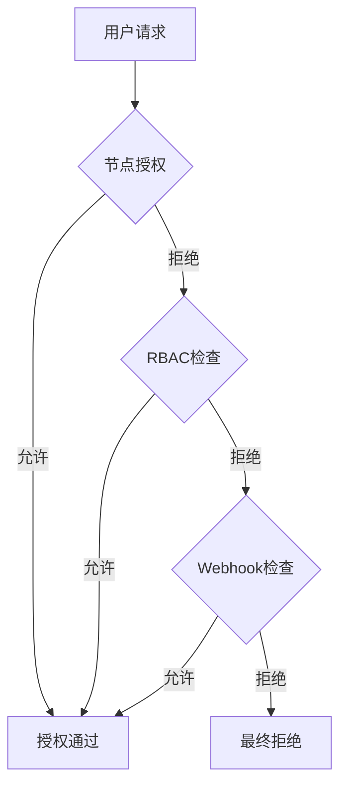

# Kubernetes 授权机制详解

## 目录
1. [授权的重要性](#授权的重要性)
2. [授权机制类型](#授权机制类型)
   - [节点授权 (Node Authorizer)](#节点授权-node-authorizer)
   - [基于属性的访问控制 (ABAC)](#基于属性的访问控制-abac)
   - [基于角色的访问控制 (RBAC)](#基于角色的访问控制-rbac)
   - [Webhook 授权](#webhook-授权)
   - [AlwaysAllow/AlwaysDeny 模式](#alwaysallowalwaysdeny-模式)
3. [授权模式配置](#授权模式配置)
4. [多授权模式处理流程](#多授权模式处理流程)

---

## 授权的重要性
- **权限隔离**：限制不同用户/应用的操作权限（如禁止开发人员修改集群配置）
- **最小权限原则**：仅授予完成工作所需的最低权限
- **多租户管理**：通过命名空间隔离团队/组织的资源访问
- **安全增强**：防止未授权操作导致的安全风险

---

## 授权机制类型

### 节点授权 (Node Authorizer)
- **作用对象**：Kubelet 节点
- **认证要求**：
  - 属于 `system:nodes` 组
  - 用户名格式为 `system:node:<nodeName>`
- **权限范围**：
  - 读取 Services/Endpoints
  - 管理本节点 Pods 状态
  - 报告节点状态

### 基于属性的访问控制 (ABAC)
- **实现方式**：JSON 策略文件 (JSONL)
- **特点**：
  - 直接关联用户/组与权限
  - 需要手动维护策略文件
  - 修改需重启 API Server
- **缺点**：管理复杂度随用户量增长

### 基于角色的访问控制 (RBAC)
- **核心概念**：
  - **Role**：命名空间内的权限集合
  - **ClusterRole**：集群范围的权限集合
  - **RoleBinding**：将角色绑定到用户/组
- **优势**：
  - 集中管理权限
  - 动态更新无需重启
  - 支持细粒度权限控制

### Webhook 授权
- **工作流程**：
  1. API Server 将授权请求转发到外部服务
  2. 外部服务（如 Open Policy Agent）决策
  3. 根据响应结果授权/拒绝
- **适用场景**：需要与外部授权系统集成时

### AlwaysAllow/AlwaysDeny 模式
- **AlwaysAllow**：
  - 默认模式
  - 禁用所有授权检查
- **AlwaysDeny**：
  - 完全锁定集群
  - 仅用于特殊测试场景

---

## 授权模式配置
- **配置参数**：`--authorization-mode`（kube-apiserver 启动参数）
- **支持多模式**：逗号分隔列表（例：`--authorization-mode=Node,RBAC,Webhook`）
- **处理顺序**：按配置顺序依次检查

---

## 多授权模式处理流程

处理规则：
- 任一模块通过即授权成功
- 所有模块拒绝则最终拒绝
- 模块按配置顺序执行检查

关键建议：生产环境推荐使用 RBAC + 命名空间隔离，配合 Webhook 实现审计/高级策略控制

# Kubernetes RBAC 实战指南

## 目录
1. [角色（Role）创建](#角色role创建)
2. [角色绑定（RoleBinding）](#角色绑定rolebinding)
3. [查看与管理RBAC对象](#查看与管理rbac对象)
4. [权限验证方法](#权限验证方法)
5. [高级权限控制](#高级权限控制)

---

## 角色（Role）创建
### 基础角色定义
```yaml
apiVersion: rbac.authorization.k8s.io/v1
kind: Role
metadata:
  name: developer
  namespace: default  # 命名空间作用域
rules:
- apiGroups: [""]     # 核心API组（空字符串表示核心组）
  resources: ["pods"]
  verbs: ["get", "list", "create", "delete"]
- apiGroups: [""]
  resources: ["configmaps"]
  verbs: ["create"]

-------创建命令
kubectl create role developer --verb=get,list,create,delete --resource=pods -n default
kubectl create role developer --verb=create --resource=configmaps -n default
```

## 角色绑定（RoleBinding）
### 绑定用户与角色
```
apiVersion: rbac.authorization.k8s.io/v1
kind: RoleBinding
metadata:
  name: dev-user-binding
  namespace: default
subjects:
- kind: User
  name: dev-user
  apiGroup: rbac.authorization.k8s.io
roleRef:
  kind: Role
  name: developer
  apiGroup: rbac.authorization.k8s.io

------- 创建命令 ------
kubectl create rolebinding dev-user-binding \
  --role=developer \
  --user=dev-user \
  --namespace=default
```
### 查看与管理RBAC对象
```
命令	功能描述
kubectl get roles	列出所有角色
kubectl get rolebindings	列出所有角色绑定
kubectl describe role <role-name>	显示角色详细信息
kubectl describe rolebinding <binding-name>	显示角色绑定详情
```
## 权限验证方法
### 快速权限检查
```
# 检查当前用户权限
kubectl auth can-i create pods
kubectl auth can-i delete nodes

# 模拟其他用户验证
kubectl auth can-i create deployments --as=dev-user
kubectl auth can-i create pods --as=dev-user -n test
```
### 输出示例
```
yes | no  # 明确的结果反馈
```
## 高级权限控制
### 细粒度资源控制
```
rules:
- apiGroups: [""]
  resources: ["pods"]
  resourceNames: ["blue-pod", "orange-pod"]  # 指定具体资源名称
  verbs: ["get", "watch"]
```
### 多命名空间管理
```
# 在指定命名空间创建角色
kubectl create role test-developer \
  --verb=* \
  --resource=pods \
  -n test-env

# 跨命名空间绑定用户
kubectl create rolebinding cross-ns-binding \
  --role=test-developer \
  --user=dev-user \
  --namespace=test-env
```
### 最佳实践提示：
1. 始终遵循最小权限原则
2. 使用命名空间进行环境隔离
3. 定期审计权限配置
4. 结合 kubectl auth can-i 进行权限测试
5. 对敏感操作使用资源名称白名单控制

### 重點補充
1. k describe pod 的 --authorization-mode= 可以看授權方式

# Kubernetes 集群角色（Cluster Roles）与集群角色绑定（Cluster Role Bindings）

## 概述
- **集群角色**（ClusterRole）和**集群角色绑定**（ClusterRoleBinding）用于控制对**集群作用域资源**（如节点、持久卷等）的访问权限。
- 与命名空间作用域的 Role 和 RoleBinding 不同，ClusterRole 和 ClusterRoleBinding 作用于整个集群。

---

## 资源作用域分类
Kubernetes 资源分为两类：

| 类型                | 示例资源                                                                 | 特点                     |
|---------------------|--------------------------------------------------------------------------|--------------------------|
| **命名空间作用域**   | Pods, Deployments, Services, Roles, RoleBindings, Secrets                | 需要指定命名空间         |
| **集群作用域**       | Nodes, PersistentVolumes, ClusterRoles, ClusterRoleBindings, Namespaces | 无需命名空间，全局可见   |

> 查看完整列表：  
> `kubectl api-resources --namespaced=true` （命名空间作用域）  
> `kubectl api-resources --namespaced=false` （集群作用域）

---

## 核心用途
### 1. 集群作用域资源授权
- **示例场景**：
  - 授权用户管理集群节点（Nodes）
  - 授权用户管理持久卷（PersistentVolumes）

### 2. 跨命名空间访问控制
- **特殊用法**：即使对命名空间作用域资源（如 Pods），使用 ClusterRole 可授予用户**所有命名空间**的访问权限。

---

## 定义与使用
### 创建 ClusterRole
```yaml
# cluster-admin-role.yaml
apiVersion: rbac.authorization.k8s.io/v1
kind: ClusterRole
metadata:
  name: cluster-admin-role
rules:
- apiGroups: [""]
  resources: ["nodes"]
  verbs: ["get", "list", "create", "delete"]

应用配置：
kubectl apply -f cluster-admin-role.yaml
```
## 创建 ClusterRoleBinding
```
# cluster-admin-binding.yaml
apiVersion: rbac.authorization.k8s.io/v1
kind: ClusterRoleBinding
metadata:
  name: cluster-admin-binding
subjects:
- kind: User
  name: cluster-admin-user
  apiGroup: rbac.authorization.k8s.io
roleRef:
  kind: ClusterRole
  name: cluster-admin-role
  apiGroup: rbac.authorization.k8s.io
```
应用配置：
kubectl apply -f cluster-admin-binding.yaml

```
关键区别
Role / RoleBinding	ClusterRole / ClusterRoleBinding
作用范围	单个命名空间内	整个集群
绑定资源类型	仅命名空间作用域资源	集群作用域资源或跨命名空间资源
典型用例	开发团队对某命名空间的权限	集群管理员、存储管理员等全局角色
```

## 注意事项
1. 默认集群角色：Kubernetes 初始化时会自动创建多个 ClusterRole（如 view, edit, admin, cluster-admin）
2. 谨慎授权：cluster-admin 角色拥有完全集群控制权，需严格控制绑定
3. 混合使用：ClusterRole 可与 RoleBinding 配合使用，实现跨命名空间授权