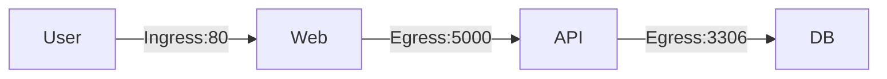

# Kubernetes 网络策略(Network Policy)详解

## 基础网络概念
### 流量方向定义
- **Ingress(入站)**：进入目标Pod的流量（实线表示）
- **Egress(出站)**：从源Pod发出的流量（实线表示）
  *注：返回响应流量（虚线）不属于策略控制范围*

  不支援 fannel

### 典型三层应用流量示例

### Kubernetes 默认网络行为
- 全通规则：默认允许所有Pod间通信（包括跨节点）
- 服务发现：可通过Pod IP/名称或Service进行通信
- 安全隐患：前端Web Pod可直接访问数据库Pod

### 网络策略核心机制
#### 策略生效原理
- 标签选择器：通过podSelector关联目标Pod
- 规则类型：需显式声明policyTypes(ingress/egress)
#### 规则组成：
- 允许的通信方向
- 合法流量来源（使用标签选择器）
- 开放端口列表
### 典型策略示例：隔离数据库
```
apiVersion: networking.k8s.io/v1
kind: NetworkPolicy
metadata:
  name: db-policy
spec:
  podSelector:
    matchLabels:
      role: database
  policyTypes:
  - Ingress
  ingress:
  - from:
    - podSelector:
        matchLabels:
          role: api-server
    ports:
    - protocol: TCP
      port: 3306
```
### 关键配置说明
```
配置项	作用	注意事项
podSelector	指定策略应用的Pod	使用标签匹配机制
policyTypes	声明策略类型(必须显式声明)	未声明则不会隔离对应方向流量
from/to	定义合法流量的来源/目标	可嵌套多层选择器
ports	指定允许的端口列表	需同时指定协议(TCP/UDP/SCTP)
```
### 实施注意事项
1. 网络插件要求：
    - 支持插件：Calico、Weave Net、kube-router等
    - 不支持插件：Flannel（需额外组件）
2. 默认行为：
    - 未应用策略的Pod：保持全通
    - 应用策略的Pod：仅允许显式规则+默认拒绝
3. 策略组合效果：
    - 多个策略作用于同一Pod时取并集
    - 空ingress/egress规则表示拒绝所有
4. 调试技巧：
```
kubectl describe networkpolicy <name>
kubectl get pod <name> --show-labels
```
### 生产环境最佳实践
1. 最小权限原则：只开放必要端口
2. 分层防护：
    - 前端：允许80/443入站
    - API层：仅允许前端Pod访问
    - 数据层：仅允许API层Pod访问
3. 命名空间隔离：结合Namespace进行多租户网络隔离