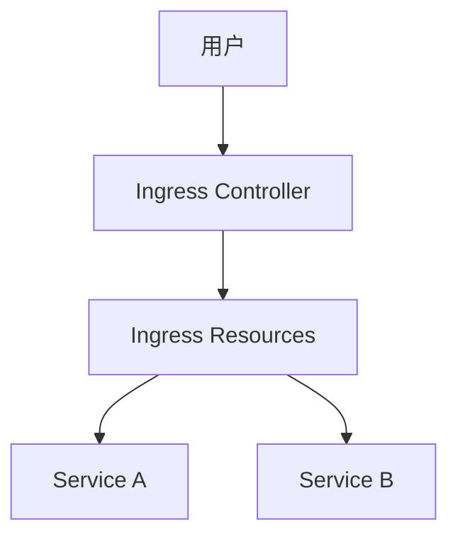

# Kubernetes Ingress 详解

## 1. Service 与 Ingress 的区别
- **Service**:
  - ClusterIP: 内部服务通信 (如应用访问MySQL)
  - NodePort: 通过节点IP+高端口(>30000)暴露服务
  - LoadBalancer: 云平台自动配置负载均衡器(每个服务独立IP)

- **Ingress**:
  - 集群内置的7层负载均衡器
  - 通过单一入口点管理多服务路由
  - 支持基于URL路径和主机名的路由规则
  - 集中管理SSL/TLS终止

## 2. 为什么需要Ingress？
| 问题场景 | NodePort方案缺点 | Ingress解决方案 |
|---------|----------------|----------------|
| 用户需要记住端口号 | 只能使用高端口号 | 通过标准端口(80/443)访问 |
| 多服务需要多个LB | 每个服务需独立LB(成本高) | 单一入口点管理所有服务 |
| 动态路由需求 | 每次新增服务需重配置LB | 通过K8s资源声明式配置 |
| SSL配置分散 | 需在应用或LB层单独配置 | 集中管理SSL证书 |

## 3. Ingress 架构组成


### 3.1 Ingress Controller
> 需单独部署的组件(非K8s内置)
> 常见实现: NGINX, GCE, Contour, HAProxy, Traefik
- 功能:
    1. 监控Ingress资源变化
    2. 动态配置负载均衡规则
    3. 处理SSL终止

### 3.2 Ingress Resources
> 通过YAML定义的路由规则
- 主要配置类型:
    1. 简单路由: 所有流量到单一后端
    2. 路径路由: 基于URL路径分流
    3. 主机路由: 基于域名分流
## Ingress 配置示例
```
4.1 基础Ingress配置 yaml
apiVersion: extensions/v1beta1
kind: Ingress
metadata:
  name: ingress-where
spec:
  backend:
    serviceName: where-service
    servicePort: 80
4.2 路径路由配置 yaml
spec:
  rules:
  - http:
      paths:
      - path: /where
        backend:
          serviceName: where-service
          servicePort: 80
      - path: /watch
        backend:
          serviceName: video-service
          servicePort: 80
4.3 主机路由配置yaml
spec:
  rules:
  - host: where.myonlinestore.com
    http:
      paths:
      - backend:
          serviceName: where-service
          servicePort: 80
  - host: watch.myonlinestore.com
    http:
      paths:
      - backend:
          serviceName: video-service
          servicePort: 80
```
## 部署组件:
- Ingress Controller Pod (特殊构建的NGINX镜像)
- NodePort/LoadBalancer Service
- ConfigMap (存储NGINX配置)
- ServiceAccount (带必要权限)

## 6. 实践建议
### 生产环境考虑:
1. 使用云厂商提供的Ingress Controller
2. 配置健康检查和自动扩缩
3. 集中管理SSL证书(如cert-manager)

### 调试命令:
```
kubectl get ingress
kubectl describe ingress <name>
kubectl logs <ingress-controller-pod>
```
### 成本优化:
1. 避免为每个服务创建LoadBalancer
2. 使用Ingress实现路径分流
3. 考虑使用Ingress Class管理多控制器