# 作業系統排程演算法筆記

## 📋 目錄
- [最長作業優先排程演算法](#第一部分最長作業優先排程演算法-longest-job-first-ljf)
- [最長剩餘時間優先排程演算法](#第二部分最長剩餘時間優先排程演算法-longest-remaining-time-first-lrtf)
- [輪詢排程演算法](#第三部分輪詢排程演算法-round-robin-rr)

---

## 第一部分：最長作業優先排程演算法 (Longest Job First, LJF)

### 🎯 基本概念
- **定義**：與「最短作業優先」相反，在所有已到達的行程中，選擇**執行時間最長**的行程優先執行
- **類型**：屬於**非搶佔式**排程演算法
- **本質**：是一種**基於優先級**的演算法，將較高優先級分配給執行時間較長的行程

### ⚠️ 缺點與問題

#### 🚫 飢餓問題 (Starvation)
**原因**：由於總是優先執行長行程，短行程可能因為不斷有新的、更長的行程到達而**無限期等待**

**結論**：任何基於優先級的排程演算法都可能存在飢餓問題

#### 🐌 護航效應 (Convoy Effect)
**定義**：短行程必須等待執行時間很長的行程釋放 CPU

**原因**：演算法總是先挑選最大的行程執行，導致後面的小行程被阻塞

#### 📉 吞吐量較低
**原因**：在相同時間內，優先執行短行程可以完成更多行程，而優先執行長行程會減少單位時間內完成的行程數量

#### 🔧 實踐中難以實現
**原因**：在行程執行前，很難準確預測其執行時間

### 📊 範例計算（非搶佔式）

#### 行程資料表
| 行程 | 到達時間 | 執行時間 |
|------|----------|----------|
| P1   | 0        | 12       |
| P2   | 1        | 15       |
| P3   | 2        | 18       |
| P4   | 3        | 2        |
| P5   | 4        | 16       |

#### 甘特圖

```mermaid
gantt
    title LJF 排程甘特圖
    dateFormat  X
    axisFormat %s
    
    section 行程執行
    P1 : 0, 12
    P3 : 12, 18
    P5 : 30, 16
    P2 : 46, 15
    P4 : 61, 2
```


### 計算結果表
```
行程	完成時間	週轉時間	等待時間	回應時間
P1	12	12	0	0
P2	61	60	45	45
P3	30	28	10	10
P4	63	60	58	58
P5	46	42	26	26
效能指標
排程長度 = 63

吞吐量 = 5 / 63

```

## 第二部分：最長剩餘時間優先排程演算法 (Longest Remaining Time First, LRTF)
### 🎯 基本概念
定義：與「最長作業優先」相似，但它是搶佔式的

規則：在任何排程時間點，選擇剩餘執行時間最長的行程執行

### 🔄 打破平手規則
剩餘時間相同 → 選擇到達時間較早的行程

到達時間也相同 → 選擇行程編號較小的

### ⚠️ 缺點
與「最長作業優先」相同，存在：
```
🚫 飢餓問題

🐌 護航效應

📉 低吞吐量

🔧 實踐難度
```
## 第三部分：輪詢排程演算法 (Round Robin, RR)
### 🎯 基本概念
核心機制：結合時間配額 + 先到先服務

時間配額：行程每次被允許執行的最長時間單位

資料結構：使用佇列管理就緒行程

### 📚 佇列操作規則
操作	位置	說明
插入	佇列尾端	新行程加入佇列末尾
刪除	佇列前端	從佇列開頭取出行程執行


## 📈 時間配額的影響分析
### 🔄 上下文切換次數
時間配額增大的影響：
行程執行時間變長 → 搶佔次數減少 → 上下文切換可能減少
優點：減少系統開銷，提高 CPU 效率

### ⏱️ 回應時間
時間配額增大的影響：
後面行程等待時間變長 → 平均回應時間增加
缺點：對於互動式系統較不友好

### 💡 總結
輪詢演算法透過時間配額在公平性和回應能力之間取得平衡，被現代作業系統（Windows、macOS）廣泛使用。

### 🎯 權衡重點
調整時間配額大小是在以下兩者之間取得平衡的關鍵：
系統開銷（上下文切換）
使用者體驗（回應時間）

## 📝 重點總結表
```
演算法	類型	優先級依據	主要問題	實踐難度
LJF	非搶佔式	執行時間最長	飢餓、護航效應	高
LRTF	搶佔式	剩餘時間最長	飢餓、護航效應	高
RR	搶佔式	時間配額+FCFS	回應時間可能較長	中
```

----------------------------------------------

# 作業系統排程演算法與行程狀態筆記
## Round Robin 排程演算法的優點
1. 沒有飢餓問題
- 原因：Round Robin 不是基於優先級的排程演算法
- 本質上 = FCFS + 時間量子
- 在 FCFS 中，先進入 RAM 的行程會先獲得 CPU
- 行程按照 FIFO 順序存取 CPU
- 高優先級行程不會一直抵達導致低優先級行程等待

2. 沒有護航效應問題
- 護航效應：小行程等待大行程釋放 CPU
- 在 Round Robin 中，即使是大行程也只執行一個時間量子
- 不會讓小行程長時間等待
- 平均周轉時間和等待時間不會因此增加

3. 實際可實現
- 不需要知道行程的執行時間
- 只需要知道到達時間（可透過電腦時鐘輕易獲得）
- 與 SJF、SRTF 等需要知道執行時間的演算法不同

4. 吞吐量適中
- 比 FCFS 好，因為不會完全執行一個行程後才切換
- 不如 SJF 和 SRTF，因為後者會優先執行短行程

5. 響應時間良好
- 不會完全執行一個行程後才切換到下一個
- 每個行程都能在短時間內獲得 CPU 時間

## 優先級排程演算法
1. 基本概念
    - 基於優先級數字進行排程
    - 優先級數字的意義由問題定義：
        - 數字越大優先級越高，或
        - 數字越小優先級越高
2. 非搶占式優先級排程
    - 一旦行程開始執行，就會執行到完成
    - 按照優先級順序選擇行程
    - 計算完成時間、周轉時間、等待時間
3. 搶占式優先級排程
    - 當更高優先級行程到達時，可搶占當前執行行程
    - 當所有行程都到達 RAM 後，行為類似非搶占式
    - 需要單獨計算響應時間

## 最高響應比優先排程演算法
1. 基本概念
    - 非搶占式排程演算法
    - 響應比 = (等待時間 + 執行時間) / 執行時間
    - 公式：RR = (W + B) / B
2. 優點
    - 高吞吐量：傾向選擇短行程
    - 減少飢餓：長時間等待的行程響應比會增加
    - 平衡考量：同時考慮等待時間和執行時間
3. 計算方式
    - 當多個行程可用時，計算每個行程的響應比
    - 選擇響應比最高的行程執行
    - 每次選擇前需要重新計算響應比（等待時間會變化）

## 行程狀態圖
### 主要狀態
1. 新建狀態：行程剛被創建
2. 就緒狀態：行程在 RAM 中，等待 CPU 執行
3. 執行狀態：行程正在 CPU 上執行
4. 阻塞狀態：行程等待 I/O 操作完成
5. 終止狀態：行程執行完成

### 狀態轉換規則
1. 從新建狀態只能轉到就緒狀態
2. 從就緒狀態只能轉到執行狀態
3. 從執行狀態可轉到：
    - 就緒狀態（時間片用完或被搶占）
    - 阻塞狀態（需要 I/O）
    - 終止狀態（執行完成）
4. 從阻塞狀態只能轉到就緒狀態

### 掛起狀態
- 掛起就緒：行程被移出 RAM 到硬碟，但處於就緒狀態
- 掛起阻塞：行程被移出 RAM 到硬碟，且處於阻塞狀態

### 交換機制
- 換入：從硬碟移動行程到 RAM
- 換出：從 RAM 移動行程到硬碟
- 由中期排程器決定哪個行程應該被換出

### 排程器類型
1. 長期排程器：決定哪些行程進入 RAM
2. 短期排程器：決定 CPU 下次執行哪個行程
3. 中期排程器：決定哪個行程應該被換出

## 重要概念總結
- CPU 效率 = (CPU 忙碌時間 / 總時間) × 100%
- 響應時間：從行程到達到第一次獲得 CPU 的時間
- 周轉時間：從行程到達到完全執行完成的時間
- 等待時間：行程在就緒隊列中等待的總時間