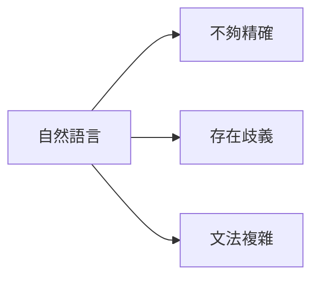

# 布林代數與邏輯基礎筆記

## 課程章節重點
- **本節主題**：布林代數複習
- **學習建議**：即使學過也不要跳過，後續課程很重要
- **未來連接**：量子密碼學建立在布林邏輯基礎上

## 什麼是布林代數？

### 基本概念對比
| 傳統代數 | 布林代數 |
|---------|----------|
| 處理實數運算 | 處理邏輯陳述 |
| 加減乘除運算 | AND, OR, NOT 運算 |
| 數字計算 | 真假值判斷 |

### 布林陳述（Boolean Statements）
- **定義**：只能是**真(true)**或**假(false)**的陳述
- **特性**：沒有第三種可能值
- **範例**：
  - "Alice 擁有一輛紅色汽車"
  - "Bob 年齡超過40歲" 
  - "Alice 昨天晚餐吃了蘑菇"

## 為什麼需要布林代數？

### 自然語言的問題

### 數學語法的優勢
```
graph LR
E[布林代數] --> F[定義精確]
E --> G[沒有歧義]
E --> H[規則明確]
```

## 布林運算子
### 三大基本運算
|運算子	| 數學符號 | 功能說明 |	範例
|AND   |    ∧	 |邏輯「且」| A ∧ B
|OR	   |    ∨	 |邏輯「或」| A ∨ B
|NOT   |    ¬	 |邏輯「非」|	¬A

### 實際應用範例
```
"Alice 擁有一輛紅色汽車" AND "Alice 昨天晚餐吃了蘑菇"
```
> 組合結果：也是一個布林陳述，具有真或假的值

## 布林代數的價值
### 數學化表達的好處
1. 符號化表示
    - 用變數代表陳述
    - 用運算子代表邏輯關係
2. 規則化運算
    - 有明確的代數規則
    - 可以機械化推導
3.  抽象化思考
    - 不需要理解陳述的現實意義
    - 專注於邏輯結構
### 與傳統代數的相似性
```
算術代數：a × (b + c) = a×b + a×c
布林代數：也有類似的運算規則
```

### 布林代數核心特性
- ✅ 二值系統：只有真和假兩種值
- ✅ 精確定義：每個運算子意義明確
- ✅ 組合能力：可以建立複雜邏輯表達式
- ✅ 數學基礎：有完整的代數運算規則


### 基本運算表示
| 運算 | 符號表示 | 實際意義 |
|------|----------|----------|
| **AND** | A ∧ B | A 且 B 都成立 |
| **OR** | A ∨ B | A 或 B 至少一個成立 |
| **NOT** | ¬A | A 不成立 |

## 運算優先順序

### 計算優先級
1. 第一優先：NOT
2. 第二優先：AND
3. 第三優先：OR

### 括號使用
- 用括號明確指定計算順序
- **範例**：
    - A ∧ (B ∨ C) 不同於 (A ∧ B) ∨ C

## 布林代數與算術代數類比

### 相似之處
| 布林代數 | 算術代數 | 說明 |
|----------|----------|------|
| AND (∧) | 乘法 (×) | 類似乘法運算 |
| OR (∨) | 加法 (+) | 類似加法運算 |
| 分配律 | 分配律 | A ∧ (B ∨ C) = (A ∧ B) ∨ (A ∧ C) |

### 重要差異
- **NOT 運算子** ≠ 算術的負號
- **NOT 有特殊運算規則**

## NOT 運算子的特殊規則

### 雙重否定
```
¬(¬A) = A
```


### 德摩根定律
1. ¬(A ∧ B) = ¬A ∨ ¬B
2. ¬(A ∨ B) = ¬A ∧ ¬B


**記憶口訣**：
- NOT 展開時，AND 與 OR **互相轉換**
- 同時對每個變數取 NOT

## 布林表達式化簡範例

### 範例 1：基本分配律
- 原始：A ∧ (B ∨ C)
- 化簡：(A ∧ B) ∨ (A ∧ C)


### 範例 2：德摩根定律應用
- 原始：¬(A ∧ B) ∨ C
- 化簡：(¬A ∨ ¬B) ∨ C


### 範例 3：雙重否定消除
- 原始：¬(¬A ∧ B)
- 化簡：A ∨ ¬B


## 逐步化簡技巧

### 方法論


### 化簡步驟
1. 處理 NOT 運算
2. 展開括號
3. 合併相同項
4. 檢查是否最簡

## 布林代數的實用價值
### 符號化操作的優勢
- 抽象思考：不需要理解現實意義
- 機械化推導：按照規則逐步化簡
- 保證正確：正確應用規則保證結果等價
- 效率提升：快速處理複雜邏輯

### 應用場景
```
現實問題 → 布林表達式 → 代數化簡 → 簡化結果
```

# 真值表與邏輯閘筆記

## 真值表基礎

### 真值表概念
- **定義**：列出所有可能輸入組合對應輸出的表格
- **用途**：定義布林函數和運算子
- **規則**：n個輸入 → 2ⁿ個列數

### 數值表示
- TRUE = 1, FALSE = 0
- 電路表示：ON = 1, OFF = 0


## 基本運算子真值表

### AND 運算子 (且)
| A | B | A ∧ B |
|---|---|-------|
| 0 | 0 | 0 |
| 0 | 1 | 0 |
| 1 | 0 | 0 |
| 1 | 1 | 1 |

**特性**：只有當兩個輸入都為1時，輸出才為1

### OR 運算子 (或)
| A | B | A ∨ B |
|---|---|-------|
| 0 | 0 | 0 |
| 0 | 1 | 1 |
| 1 | 0 | 1 |
| 1 | 1 | 1 |

**特性**：只要有一個輸入為1，輸出就為1

### NOT 運算子 (非)
| A | ¬A |
|---|----|
| 0 | 1 |
| 1 | 0 |

**特性**：輸出與輸入相反

### NAND 運算子
| A | B | A NAND B |
|---|---|---------|
| 0 | 0 | 1 |
| 0 | 1 | 1 |
| 1 | 0 | 1 |
| 1 | 1 | 0 |

**定義**：NAND = NOT(AND)
**特性**：只有當兩個輸入都為1時，輸出才為0

## 邏輯閘與電路

### 邏輯閘概念
- 布林運算 → 邏輯閘
- 電路實現 → 數位電腦基礎

### 基本邏輯閘符號

#### AND 閘

```
輸入A ──┐
        ├─ AND ── 輸出
輸入B ──┘
```

- 兩個輸入，一個輸出
- 輸出ON僅當兩個輸入都ON

#### OR 閘
```
輸入A ──┐
        ├─ OR ── 輸出
輸入B ──┘
```

- 兩個輸入，一個輸出
- 任一輸入ON則輸出ON

#### NOT 閘

```
輸入 ── NOT ── 輸出
```
- 一個輸入，一個輸出
- 三角形末端小圓圈表示反相

## 邏輯電路分析範例

### 電路結構
```
輸入A ──┐
        ├─ AND ──┐
輸入B ──┘        │
                 ├─ OR ── NOT ── 最終輸出
輸入C ───────────┘
```
> 對應布林表達式
- 輸出 = NOT( (A AND B) OR C )


### 運算順序
1. **第一層**：A AND B
2. **第二層**：結果 OR C  
3. **第三層**：NOT(最終OR結果)

## 邏輯閘的組合應用

### 隱含NOT操作
- 小圓圈可與其他閘組合使用
- 表示在該點進行NOT運算

### 電路設計意義
- 布林表達式 → 邏輯閘電路
- 邏輯閘電路 → 電子信號處理
- 電子信號處理 → 複雜邏輯計算

## 重點總結

### 真值表重要性
- ✅ 完整定義運算子行為
- ✅ 處理非直覺運算子（如NAND）
- ✅ 提供系統化分析方法

### 邏輯閘核心概念
- ✅ 布林值 ↔ 電路信號（ON/OFF）
- ✅ 基本閘：AND, OR, NOT
- ✅ 閘可組合實現複雜邏輯
- ✅ 現代數位電腦的基礎

# 多輸入邏輯閘與通用閘筆記

## 多輸入邏輯閘

### 多輸入閘的實現
- **3輸入AND閘**：A AND B AND C
- **3輸入OR閘**：A OR B OR C
- **優勢**：方便構建複雜電路

### 多輸入閘的等價實現
- 3輸入AND閘 = (A AND B) AND C
- 3輸入OR閘 = (A OR B) OR C


## 邏輯閘的等價轉換

### 用OR和NOT構建AND閘
**電路配置**：
```
A ──┐
├─ OR ── NOT ── 輸出
B ──┘
```

**布林表達式**：NOT(NOT A OR NOT B) = A AND B

### 驗證方法：真值表比對
| A | B | NOT(NOT A OR NOT B) | A AND B |
|---|---|---------------------|---------|
| 0 | 0 | 0 | 0 |
| 0 | 1 | 0 | 0 |
| 1 | 0 | 0 | 0 |
| 1 | 1 | 1 | 1 |

**重要原則**：真值表相同 → 功能相同

## NAND通用閘

### NAND閘特性
**符號**：AND閘輸出端加小圓圈
**表達式**：C = A NAND B
**真值表**：
| A | B | A NAND B |
|---|---|----------|
| 0 | 0 | 1 |
| 0 | 1 | 1 |
| 1 | 0 | 1 |
| 1 | 1 | 0 |

### 用NAND構建基本閘

#### NOT閘

```
輸入 ──┬─ NAND ── 輸出
└─
```
**原理**：A NAND A = NOT A

#### AND閘
```
A ──┐
    ├─ NAND ── NAND(作為NOT) ── 輸出
B ──┘

```
#### OR閘
```
A ── NAND(作為NOT) ──┐
                    ├─ NAND ── 輸出
B ── NAND(作為NOT) ──┘
```

**關鍵結論**：NAND是通用閘，可單獨實現所有邏輯功能

## 異或閘(XOR)與量子計算

### XOR閘特性
**符號**：OR閘加額外曲線
**真值表**：
| A | B | A XOR B |
|---|---|---------|
| 0 | 0 | 0 |
| 0 | 1 | 1 |
| 1 | 0 | 1 |
| 1 | 1 | 0 |

### 原子XOR操作
**概念**：A = A XOR B（單一原子操作）
**量子計算重要性**：
- 量子賦值不可逆，只能在計算開始時執行一次
- 量子XOR可逆，可在計算過程中多次執行

### 用XOR實現賦值
```
步驟1：初始化 A = 0
步驟2：A = A XOR B
結果：A = B
```


## 位元序列的XOR操作

### 操作規則
- 對兩個相同長度的位元序列逐位元XOR
- 結果為相同長度的新序列

### 範例計算
```
A = 1010
B = 1100
A XOR B = 0110
```


## XOR的數學性質與應用

### 重要性質
- A XOR B XOR B = A
**意義**：對同一值XOR兩次會恢復原始值

### 序列驗證範例
```
A = 1011
B = 1100

第一次XOR：A XOR B = 0111
第二次XOR：0111 XOR B = 1011 = A
```


### 量子密碼學應用
- 利用XOR的可逆性質
- 實現安全的量子金鑰分發
- 加密：明文 XOR 金鑰 = 密文
- 解密：密文 XOR 金鑰 = 明文

## 重點總結

### 通用閘概念
- ✅ NAND閘可單獨實現所有邏輯功能
- ✅ 簡化硬體設計，提高製造效率

### XOR的量子重要性
- ✅ 可逆操作，適合量子計算
- ✅ 可替代不可逆的賦值操作
- ✅ 量子密碼學的基礎操作

### 實際應用
> 「從古典邏輯電路過渡到量子計算基礎」

- 理解通用閘在硬體設計的價值
- 掌握XOR在量子算法中的關鍵作用
- 為學習量子加密技術奠定基礎