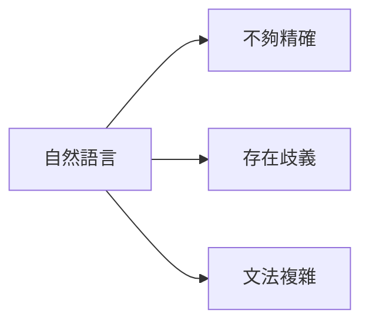

# 布林代數與邏輯基礎筆記

## 課程章節重點
- **本節主題**：布林代數複習
- **學習建議**：即使學過也不要跳過，後續課程很重要
- **未來連接**：量子密碼學建立在布林邏輯基礎上

## 什麼是布林代數？

### 基本概念對比
| 傳統代數 | 布林代數 |
|---------|----------|
| 處理實數運算 | 處理邏輯陳述 |
| 加減乘除運算 | AND, OR, NOT 運算 |
| 數字計算 | 真假值判斷 |

### 布林陳述（Boolean Statements）
- **定義**：只能是**真(true)**或**假(false)**的陳述
- **特性**：沒有第三種可能值
- **範例**：
  - "Alice 擁有一輛紅色汽車"
  - "Bob 年齡超過40歲" 
  - "Alice 昨天晚餐吃了蘑菇"

## 為什麼需要布林代數？

### 自然語言的問題

### 數學語法的優勢
```
graph LR
E[布林代數] --> F[定義精確]
E --> G[沒有歧義]
E --> H[規則明確]
```

## 布林運算子
### 三大基本運算
|運算子	| 數學符號 | 功能說明 |	範例
|AND   |    ∧	 |邏輯「且」| A ∧ B
|OR	   |    ∨	 |邏輯「或」| A ∨ B
|NOT   |    ¬	 |邏輯「非」|	¬A

### 實際應用範例
```
"Alice 擁有一輛紅色汽車" AND "Alice 昨天晚餐吃了蘑菇"
```
> 組合結果：也是一個布林陳述，具有真或假的值

## 布林代數的價值
### 數學化表達的好處
1. 符號化表示
    - 用變數代表陳述
    - 用運算子代表邏輯關係
2. 規則化運算
    - 有明確的代數規則
    - 可以機械化推導
3.  抽象化思考
    - 不需要理解陳述的現實意義
    - 專注於邏輯結構
### 與傳統代數的相似性
```
算術代數：a × (b + c) = a×b + a×c
布林代數：也有類似的運算規則
```

### 布林代數核心特性
- ✅ 二值系統：只有真和假兩種值
- ✅ 精確定義：每個運算子意義明確
- ✅ 組合能力：可以建立複雜邏輯表達式
- ✅ 數學基礎：有完整的代數運算規則


### 基本運算表示
| 運算 | 符號表示 | 實際意義 |
|------|----------|----------|
| **AND** | A ∧ B | A 且 B 都成立 |
| **OR** | A ∨ B | A 或 B 至少一個成立 |
| **NOT** | ¬A | A 不成立 |

## 運算優先順序

### 計算優先級
1. 第一優先：NOT
2. 第二優先：AND
3. 第三優先：OR

### 括號使用
- 用括號明確指定計算順序
- **範例**：
    - A ∧ (B ∨ C) 不同於 (A ∧ B) ∨ C

## 布林代數與算術代數類比

### 相似之處
| 布林代數 | 算術代數 | 說明 |
|----------|----------|------|
| AND (∧) | 乘法 (×) | 類似乘法運算 |
| OR (∨) | 加法 (+) | 類似加法運算 |
| 分配律 | 分配律 | A ∧ (B ∨ C) = (A ∧ B) ∨ (A ∧ C) |

### 重要差異
- **NOT 運算子** ≠ 算術的負號
- **NOT 有特殊運算規則**

## NOT 運算子的特殊規則

### 雙重否定
```
¬(¬A) = A
```


### 德摩根定律
1. ¬(A ∧ B) = ¬A ∨ ¬B
2. ¬(A ∨ B) = ¬A ∧ ¬B


**記憶口訣**：
- NOT 展開時，AND 與 OR **互相轉換**
- 同時對每個變數取 NOT

## 布林表達式化簡範例

### 範例 1：基本分配律
- 原始：A ∧ (B ∨ C)
- 化簡：(A ∧ B) ∨ (A ∧ C)


### 範例 2：德摩根定律應用
- 原始：¬(A ∧ B) ∨ C
- 化簡：(¬A ∨ ¬B) ∨ C


### 範例 3：雙重否定消除
- 原始：¬(¬A ∧ B)
- 化簡：A ∨ ¬B


## 逐步化簡技巧

### 方法論


### 化簡步驟
1. 處理 NOT 運算
2. 展開括號
3. 合併相同項
4. 檢查是否最簡

## 布林代數的實用價值
### 符號化操作的優勢
- 抽象思考：不需要理解現實意義
- 機械化推導：按照規則逐步化簡
- 保證正確：正確應用規則保證結果等價
- 效率提升：快速處理複雜邏輯

### 應用場景
```
現實問題 → 布林表達式 → 代數化簡 → 簡化結果
```

# 真值表與邏輯閘筆記

## 真值表基礎

### 真值表概念
- **定義**：列出所有可能輸入組合對應輸出的表格
- **用途**：定義布林函數和運算子
- **規則**：n個輸入 → 2ⁿ個列數

### 數值表示
- TRUE = 1, FALSE = 0
- 電路表示：ON = 1, OFF = 0


## 基本運算子真值表

### AND 運算子 (且)
| A | B | A ∧ B |
|---|---|-------|
| 0 | 0 | 0 |
| 0 | 1 | 0 |
| 1 | 0 | 0 |
| 1 | 1 | 1 |

**特性**：只有當兩個輸入都為1時，輸出才為1

### OR 運算子 (或)
| A | B | A ∨ B |
|---|---|-------|
| 0 | 0 | 0 |
| 0 | 1 | 1 |
| 1 | 0 | 1 |
| 1 | 1 | 1 |

**特性**：只要有一個輸入為1，輸出就為1

### NOT 運算子 (非)
| A | ¬A |
|---|----|
| 0 | 1 |
| 1 | 0 |

**特性**：輸出與輸入相反

### NAND 運算子
| A | B | A NAND B |
|---|---|---------|
| 0 | 0 | 1 |
| 0 | 1 | 1 |
| 1 | 0 | 1 |
| 1 | 1 | 0 |

**定義**：NAND = NOT(AND)
**特性**：只有當兩個輸入都為1時，輸出才為0

## 邏輯閘與電路

### 邏輯閘概念
- 布林運算 → 邏輯閘
- 電路實現 → 數位電腦基礎

### 基本邏輯閘符號

#### AND 閘

```
輸入A ──┐
        ├─ AND ── 輸出
輸入B ──┘
```

- 兩個輸入，一個輸出
- 輸出ON僅當兩個輸入都ON

#### OR 閘
```
輸入A ──┐
        ├─ OR ── 輸出
輸入B ──┘
```

- 兩個輸入，一個輸出
- 任一輸入ON則輸出ON

#### NOT 閘

```
輸入 ── NOT ── 輸出
```
- 一個輸入，一個輸出
- 三角形末端小圓圈表示反相

## 邏輯電路分析範例

### 電路結構
```
輸入A ──┐
        ├─ AND ──┐
輸入B ──┘        │
                 ├─ OR ── NOT ── 最終輸出
輸入C ───────────┘
```
> 對應布林表達式
- 輸出 = NOT( (A AND B) OR C )


### 運算順序
1. **第一層**：A AND B
2. **第二層**：結果 OR C  
3. **第三層**：NOT(最終OR結果)

## 邏輯閘的組合應用

### 隱含NOT操作
- 小圓圈可與其他閘組合使用
- 表示在該點進行NOT運算

### 電路設計意義
- 布林表達式 → 邏輯閘電路
- 邏輯閘電路 → 電子信號處理
- 電子信號處理 → 複雜邏輯計算

## 重點總結

### 真值表重要性
- ✅ 完整定義運算子行為
- ✅ 處理非直覺運算子（如NAND）
- ✅ 提供系統化分析方法

### 邏輯閘核心概念
- ✅ 布林值 ↔ 電路信號（ON/OFF）
- ✅ 基本閘：AND, OR, NOT
- ✅ 閘可組合實現複雜邏輯
- ✅ 現代數位電腦的基礎

# 多輸入邏輯閘與通用閘筆記

## 多輸入邏輯閘

### 多輸入閘的實現
- **3輸入AND閘**：A AND B AND C
- **3輸入OR閘**：A OR B OR C
- **優勢**：方便構建複雜電路

### 多輸入閘的等價實現
- 3輸入AND閘 = (A AND B) AND C
- 3輸入OR閘 = (A OR B) OR C


## 邏輯閘的等價轉換

### 用OR和NOT構建AND閘
**電路配置**：
```
A ──┐
├─ OR ── NOT ── 輸出
B ──┘
```

**布林表達式**：NOT(NOT A OR NOT B) = A AND B

### 驗證方法：真值表比對
| A | B | NOT(NOT A OR NOT B) | A AND B |
|---|---|---------------------|---------|
| 0 | 0 | 0 | 0 |
| 0 | 1 | 0 | 0 |
| 1 | 0 | 0 | 0 |
| 1 | 1 | 1 | 1 |

**重要原則**：真值表相同 → 功能相同

## NAND通用閘

### NAND閘特性
**符號**：AND閘輸出端加小圓圈
**表達式**：C = A NAND B
**真值表**：
| A | B | A NAND B |
|---|---|----------|
| 0 | 0 | 1 |
| 0 | 1 | 1 |
| 1 | 0 | 1 |
| 1 | 1 | 0 |

### 用NAND構建基本閘

#### NOT閘

```
輸入 ──┬─ NAND ── 輸出
└─
```
**原理**：A NAND A = NOT A

#### AND閘
```
A ──┐
    ├─ NAND ── NAND(作為NOT) ── 輸出
B ──┘

```
#### OR閘
```
A ── NAND(作為NOT) ──┐
                    ├─ NAND ── 輸出
B ── NAND(作為NOT) ──┘
```

**關鍵結論**：NAND是通用閘，可單獨實現所有邏輯功能

## 異或閘(XOR)與量子計算

### XOR閘特性
**符號**：OR閘加額外曲線
**真值表**：
| A | B | A XOR B |
|---|---|---------|
| 0 | 0 | 0 |
| 0 | 1 | 1 |
| 1 | 0 | 1 |
| 1 | 1 | 0 |

### 原子XOR操作
**概念**：A = A XOR B（單一原子操作）
**量子計算重要性**：
- 量子賦值不可逆，只能在計算開始時執行一次
- 量子XOR可逆，可在計算過程中多次執行

### 用XOR實現賦值
```
步驟1：初始化 A = 0
步驟2：A = A XOR B
結果：A = B
```


## 位元序列的XOR操作

### 操作規則
- 對兩個相同長度的位元序列逐位元XOR
- 結果為相同長度的新序列

### 範例計算
```
A = 1010
B = 1100
A XOR B = 0110
```


## XOR的數學性質與應用

### 重要性質
- A XOR B XOR B = A
**意義**：對同一值XOR兩次會恢復原始值

### 序列驗證範例
```
A = 1011
B = 1100

第一次XOR：A XOR B = 0111
第二次XOR：0111 XOR B = 1011 = A
```


### 量子密碼學應用
- 利用XOR的可逆性質
- 實現安全的量子金鑰分發
- 加密：明文 XOR 金鑰 = 密文
- 解密：密文 XOR 金鑰 = 明文

## 重點總結

### 通用閘概念
- ✅ NAND閘可單獨實現所有邏輯功能
- ✅ 簡化硬體設計，提高製造效率

### XOR的量子重要性
- ✅ 可逆操作，適合量子計算
- ✅ 可替代不可逆的賦值操作
- ✅ 量子密碼學的基礎操作

### 實際應用
> 「從古典邏輯電路過渡到量子計算基礎」

- 理解通用閘在硬體設計的價值
- 掌握XOR在量子算法中的關鍵作用
- 為學習量子加密技術奠定基礎

# 條件機率 (Conditional Probability) 筆記
## 📊 基本概念圖解
### 視覺化理解
┌─────────────────┐
│        B        │
│   ┌─────────┐   │
│   │  A ∩ B  │   │ ← 橙色區域：A和B同時發生
│   └─────────┘   │
└─────────────────┘

- 當已知 **A 發生**時，我們只關注 **A 的區域**（黃色區域）
- 在 A 發生的前提下，B 發生的機率 = **A∩B 區域**佔**A 區域**的比例

## 🧮 數學公式
### 條件機率公式
P(B|A) = P(A ∩ B) / P(A)
P(A|B) = P(A ∩ B) / P(B)

### 符號說明
- `P(B|A)`：在 A 發生的條件下，B 發生的機率
- `P(A ∩ B)`：A 和 B 同時發生的機率
- `P(A)`：A 發生的機率

## 🔍 圖像化思考方式
### 比例縮放法
原始情況：
A區域面積 = P(A)
A∩B區域面積 = P(A ∩ B)

放大後：
A區域面積 → 1（100%）
A∩B區域面積 → P(A ∩ B) / P(A)

### 為什麼這樣放大？
- 目標：讓 **P(A) 變成 1**（代表100%）
- 放大比例因子 = **1/P(A)**
- 原始黃色區域面積 P(A) × (1/P(A)) = 1

## 🛒 實際應用範例

### 超市購物情境
| 項目 | 人數 | 機率 |
|------|------|------|
| 總顧客數 | 100人 | 1.0 |
| 買蘋果 | 10人 | 0.1 |
| 買橘子 | 20人 | 0.2 |
| 同時買蘋果和橘子 | 5人 | 0.05 |

### 問題求解
**問題：** 已知愛麗絲買了蘋果，求她也買橘子的機率
**計算過程：**
```
P(橘子|蘋果) = P(橘子 ∩ 蘋果) / P(蘋果)
= 0.05 / 0.1
= 0.5
```
**答案：** 50% 的機率

## 💡 關鍵重點總結
1. **範圍縮小**：條件機率是在「已知某條件發生」的前提下，重新計算機率
2. **分母原則**：分母永遠是「已知條件」的機率
3. **分子原則**：分子是「兩事件同時發生」的機率
4. **應用時機**：當有額外資訊時，用條件機率來更新對事件的預測

## 🎯 記憶口訣
> 已知A發生的情況下，
> B發生的機率 = (A和B一起發生) ÷ (A單獨發生)

# 隨機變數與統計量筆記
## 隨機變數 (Random Variables)
### 基本概念
- **布林函數**：結果為真/假（發生/不發生）
- **隨機變數**：結果為實數值的不確定函數
- 現實世界中隨機變數更常見（如：溫度、風速、股價變化）

### 定義隨機變數的步驟
1. **建立完整互斥事件集**
   - 事件必須互斥且完整
   - 每次實驗只會發生其中一個事件

2. **將每個事件映射到實數**
   - 每個結果對應一個實數值

### 範例
#### 🎲 骰子投擲
**映射1**：顯示點數直接作為值
```math
平均值 = (1+2+3+4+5+6)/6 = 3.5
```
**映射2**: 1 → -3, 2 → -2, 3 → -1, 4 → +1, 5 → +2, 6 → +3
```
平均值 = (-3-2-1+1+2+3)/6 = 0
```
#### 🪙 硬幣投擲
映射：正面→+1，反面→-1
```
平均值 = 0
```
#### 🚗 汽車顏色選擇
將每種顏色映射到實數，形成隨機變數
####  期望值 (Expected Value)
計算公式
對於有 m 個可能結果的隨機變數：
```math
E[X] = v₁ × P(v₁) + v₂ × P(v₂) + ... + vₘ × P(vₘ)
```
或
```
E[X] = \sum_{i=1}^{m} v_i × P(v_i)
```

###  範例計算
####  🎲 不公平骰子
```
點數	概率	計算
1	0.1	1 × 0.1
2	0.1	2 × 0.1
3	0.1	3 × 0.1
4	0.2	4 × 0.2
5	0.2	5 × 0.2
6	0.3	6 × 0.3
```
```
期望值 = 0.1 + 0.2 + 0.3 + 0.8 + 1.0 + 1.8 = 4.2
```
#### 🪙 不公平硬幣
反面(-1)：概率 0.48
正面(+1)：概率 0.52
```
期望值 = (-1)×0.48 + (+1)×0.52 = 0.04
```
### 變異數與標準差
> 為什麼需要標準差？
期望值相同不代表隨機變數行為相同

- 需要衡量數據的離散程度（散布範圍）

#### 變異數 (Variance)
計算步驟：
1. 計算每個結果與期望值的差：(vᵢ - μ)
2. 平方差異：(vᵢ - μ)²
3. 加權平均：Σ (vᵢ - μ)² × P(vᵢ)

公式：
```
Var(X) = E[(X - μ)²] = \sum (v_i - μ)² × P(v_i)
```
###  標準差 (Standard Deviation)
```
σ = \sqrt{Var(X)}
```
#### 範例計算
##### 🎲 公平骰子（映射為點數）
- 期望值 μ = 3.5
- 變異數計算：
```
\frac{(1-3.5)²}{6} + \frac{(2-3.5)²}{6} + \cdots + \frac{(6-3.5)²}{6} = 2.91667
標準差 σ = √2.91667 ≈ 1.708
```
##### 🪙 公平硬幣（映射-1/+1）
- 期望值 μ = 0
- 變異數 = [(-1-0)²×0.5 + (1-0)²×0.5] = 1
- 標準差 = 1
##### 🪙 公平硬幣（映射-10/+10）
- 期望值 μ = 0
- 變異數 = [(-10-0)²×0.5 + (10-0)²×0.5] = 100
- 標準差 = 10

# 隨機變數運算與複數數學
## 隨機變數的運算
### 隨機變數的加法
- 隨機變數可以像函數一樣進行算術運算
- **重要性質**：兩個隨機變數之和的期望值等於各自期望值之和
```math
E[X + Y] = E[X] + E[Y]
```
###  範例分析
#### 公平硬幣 + 公平骰子：
- X（硬幣）：-1（反面）, +1（正面），E[X] = 0
- Y（骰子）：1,2,3,4,5,6，E[Y] = 3.5
- X+Y 的期望值 = 0 + 3.5 = 3.5

### 隨機變數的相關性
#### 🎯 相關隨機變數範例
- 情境1： 一個紅幣一個綠幣，隨機分配
    - RVA（Alice）：紅幣→+1，綠幣→-1
    - RVB（Bob）：紅幣→+1，綠幣→-1
    - 關係：RVA × RVB = -1（常數）
- 情境2： 兩個相同顏色的幣
    - RVA 和 RVB 總是相同
    - RVA × RVB = +1（常數）
### 🔄 獨立隨機變數
- 情境3： 每個信封獨立隨機選擇幣
```
RVA	RVB	乘積	概率
-1	-1	+1	0.25
-1	+1	-1	0.25
+1	-1	-1	0.25
+1	+1	+1	0.25
```
```
E[RVA × RVB] = 0
```
#### 相關性檢測
- 計算 E[XY] 可以檢測隨機變數的相關性
- 不相關時：E[XY] 有特定值
- 相關時：E[XY] 會不同

## 複數數學
### 為什麼需要複數？
#### 💡 實用理由
- 數學簡化：用複數表示物理轉換時數學更簡單
- 中間值：複數作為中間值，不直接對應現實世界量值

#### 🧮 理論理由
- 代數完備性：任何代數運算結果仍是複數
- 統一表示：所有虛數量都可以用 i 表示

## 複數定義
```
i = \sqrt{-1}
```
### 一般形式：
```
a + bi
a：實部（real part）
b：虛部係數
bi：虛部（imaginary part）
```
### 複數運算
- ✖️ 純量乘法
    - (-4)(2 - 3i) = -8 + 12i
- ➗ 純量除法
    - (7 + 2i) ÷ (-3) = -\frac{7}{3} - \frac{2}{3}i
- 複數乘法
    1. 將 i 視為代數中的未知數
    2. 遇到 i² 時替換為 -1
```
(-7 + 2i)(3 - 4i) = -21 + 28i + 6i - 8i²
// 虛數的平方根
\sqrt{-4} = \sqrt{4} × \sqrt{-1} = 2i
// i 的平方根
根號(i) = (1 + i) / 根號(2) 
// 驗證：
[(1 + i) / 根號(2)]² = (1 + i)² / 2 = (1 + 2i + i²) / 2 = (1 + 2i - 1) / 2 = i
```
### 重點總結
#### 隨機變數
- 期望值具有可加性：E[X+Y] = E[X] + E[Y]
- 乘積的期望值 E[XY] 可用來檢測相關性
- 相關性影響隨機變數組合後的行為

#### 複數
- 形式：a + bi，其中 i² = -1
- 運算：類似代數運算，遇到 i² 替換為 -1
- 用途：簡化數學計算，提供完備的代數系統
- 書寫慣例：實部在前，虛部在後
#### 關鍵洞察
- 隨機變數的相關性會影響其組合行為
- 複數是強大的數學工具，雖然不直接對應現實量值，但能大幅簡化計算
- 量子物理中使用複數來描述系統狀態和轉換

# 複數運算與極座標表示法
## 複數共軛 (Complex Conjugate)
### 定義
1. 對於複數 a + bi，其共軛複數為 a - bi
2. 只需改變虛部的符號
### 範例
1. 2 + 3i 的共軛複數：2 - 3i
2. 7 - 6i 的共軛複數：7 + 6i
3. -2 - 3i 的共軛複數：-2 + 3i
## 模平方 (Squared Magnitude)
### 定義
1. 對於複數 a + bi，模平方 = a² + b²
2. 性質：複數 × 共軛複數 = 模平方
## 範例
1. 2 + 3i 的模平方：
    - 方法一：2² + 3² = 4 + 9 = 13
    - 方法二：(2 + 3i)(2 - 3i) = 4 - 9i² = 4 + 9 = 13
2. 7 - 6i 的模平方：7² + (-6)² = 49 + 36 = 85
## 複數除法
### 方法
將分母轉換為實數：
```
(a + bi) / (c + di) = (a + bi)/(c + di) × (c - di)/(c - di)
```
### 步驟
1. 分子分母同乘分母的共軛複數
2. 分母變為實數（模平方）
3. 展開分子計算
4. 複數除以實數
### 範例
- 例1： (1 + 2i) / (3 + 4i)
```
= (1 + 2i)/(3 + 4i) × (3 - 4i)/(3 - 4i)
= [(1 + 2i)(3 - 4i)] / (9 + 16)
= (3 - 4i + 6i - 8i²) / 25
= (11 + 2i) / 25
= 11/25 + (2/25)i
```
## 歐拉公式與極座標形式
### 歐拉公式
```
e^(ix) = cos x + i sin x
```
### 性質
- 模平方：|e^(ix)|² = cos²x + sin²x = 1
- 任何模平方為1的複數都可寫成 e^(ix) 形式
## 極座標形式 (Polar Form)
- 任何複數 a + bi 可表示為：
```
a + bi = r × e^(ix)
```
- 其中：
    1. r = √(a² + b²)（模長）
    2. cos x = a/r，sin x = b/r
## 座標轉換範例
### 極座標轉標準形式
1. 例1： 10e^(iπ/4)
```
= 10[cos(π/4) + i sin(π/4)]
= 10[√2/2 + i(√2/2)]
= 5√2 + 5√2 i
```
### 標準形式轉極座標
1. 例1： √2 + √2 i
```
r = √[(√2)² + (√2)²] = √(2 + 2) = 2
cos x = √2/2 = 1/√2 ⇒ x = π/4
∴ √2 + √2 i = 2e^(iπ/4)
```

# 複數運算與線性代數筆記
## 複數的冪與根
### 複數的整數次方
1. 直接相乘：例如 (a + bi)³ = (a + bi) × (a + bi) × (a + bi)
2. 使用代數展開計算
### 複數的分數次方（根）
### 使用極座標形式計算更簡單：
- 先轉換為極座標形式：r e^(ix)
- 計算冪次：(r e^(ix))^n = r^n e^(inx)
## 1 的立方根範例
1 可以表示為：
1. e^(i0) = 1
2. e^(i2π) = 1
3. e^(i4π) = 1
三個立方根：
1. e^(i0/3) = e^(i0) = 1
2. e^(i2π/3) = cos(2π/3) + i sin(2π/3) = -1/2 + (√3/2)i
3. e^(i4π/3) = cos(4π/3) + i sin(4π/3) = -1/2 - (√3/2)i
> 驗證： 每個解的立方都等於 1

### i 的平方根
```
i = e^(iπ/2)
√i = e^(iπ/4) = cos(π/4) + i sin(π/4) = 1/√2 + i/√2
```
## 複數的幾何表示
### 直角座標表示
- 複數 a + bi 對應點 (a, b)
- 實部 a = x 座標
- 虛部 b = y 座標
### 極座標表示
- r e^(iθ) 形式
- r = √(a² + b²)（模長）
- θ = 與 x 軸的夾角
- a = r cosθ
- b = r sinθ
